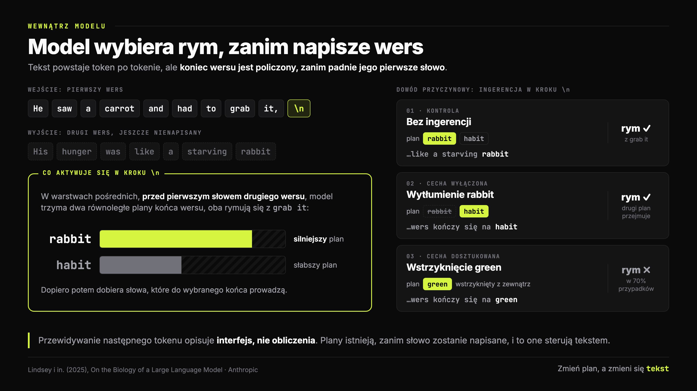
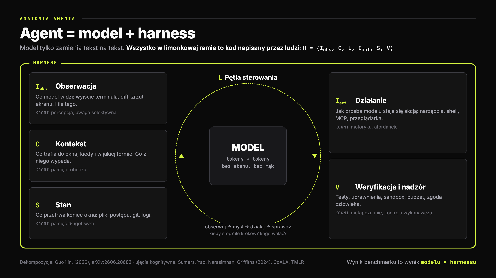
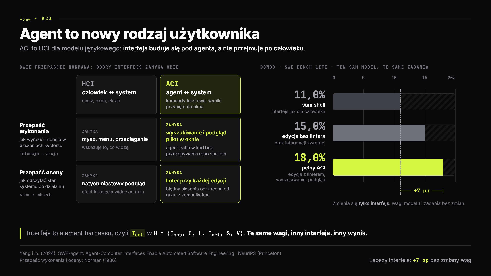
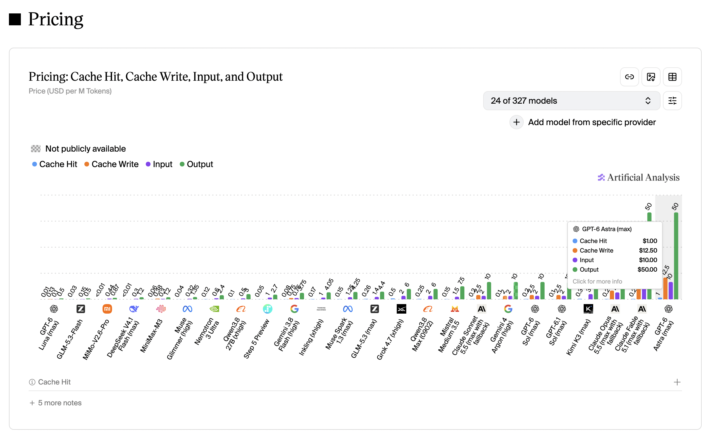
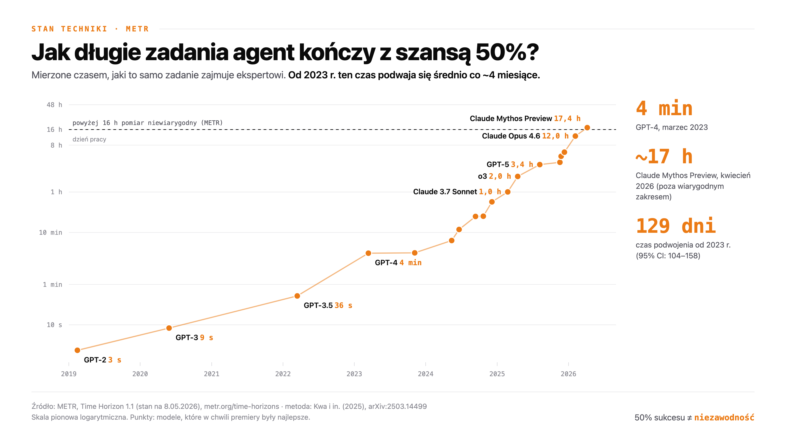

# Model to nie agent

## Agenci AI · Wykład 1

### Model to nie agent

**Anatomia harnessu: co naprawdę robi „agent”**

Kognitywistyka PJWSTK · rok 2 · semestr zimowy 2026/27

> _Notatka prowadzącego:_ Plan na 90 minut. Bloki: zagadka (10), model kontra agent (15), anatomia harnessu (30, w tym ćwiczenie), demo (10), stan techniki (15), zamknięcie (10). Nie zaczynaj od definicji. Zacznij od zagadki z następnego slajdu i każ im zgadywać.

---

## Zagadka

### Ten sam model, dwa wyniki

| | Wersja A | Wersja B |
|---|---|---|
| Model | `gpt-5.2-codex` | `gpt-5.2-codex` |
| Terminal-Bench 2.0 | **52,8%** | **66,5%** |
| Miejsce w rankingu | poza top 30 | **top 5** |

**Wagi modelu nie zmieniły się ani o bit. Co się zmieniło?**

_LangChain (2026), „Improving Deep Agents with harness engineering”_

> _Notatka prowadzącego:_ Daj im minutę w parach. Typowe odpowiedzi: „lepszy prompt”, „więcej czasu”, „inny sprzęt”. Zapisz kilka na tablicy. Terminal-Bench 2.0 to 89 trudnych zadań w terminalu (kompilacja, konfiguracja, debugowanie), opublikowany na ICLR 2026. Zespół LangChain zmienił tylko kod wokół modelu: prompt systemowy z naciskiem na samoweryfikację, lepsze narzędzia i wstrzykiwanie kontekstu o środowisku, oraz „middleware”, które wykrywa, że agent kręci się w kółko (doom loops). +13,7 punktu bez dotykania modelu.

---

## Odpowiedź

### Zmienił się harness

Wszystko, co **otacza** model:

- jakie instrukcje dostaje na start
- jakie ma narzędzia i co widzi po ich użyciu
- kto pilnuje, żeby nie kręcił się w kółko
- kto sprawdza, czy naprawdę skończył

> „The same model scores differently under different harnesses, so a Terminal-Bench number is a statement about a stack rather than a model.”

_Merrill i in. (2026), Terminal-Bench, ICLR 2026_

> _Notatka prowadzącego:_ To jest teza całego semestru. Kiedy w prasówce (wykład Rafała) czytacie „model X ma Y% na benchmarku”, to w rzeczywistości jest wynik pary model + harness. Ten sam model w różnych harnessach potrafi się różnić o kilkanaście, a w skrajnych przypadkach o ponad 20 punktów procentowych.

---

## Skąd jesteśmy

### Znacie pętlę. Dziś otwieramy maszynę, która ją kręci.

**Rok temu (wykłady 4 i 5):**

- function calling
- ReAct: myśl → działanie → obserwacja
- enaktywizm i rozszerzony umysł
- MCP, systemy wieloagentowe

<!-- columns -->

**O czym mówiliście tydzień temu:**

- „wszyscy flagowcy mówią językiem agentów”
- computer use, kontekst 1M, cache −75%
- 10 000 agentów na problemie milenijnym

**Brakujące pytanie: co jest pod spodem?**

> _Notatka prowadzącego:_ Połącz oba światy. Rafał pokazał, CO się dzieje na rynku. My przez 5 wykładów rozbieramy, JAK to działa. Każdy news z jego prasówki wróci u nas jako mechanizm: cache wróci przy kosztach pętli (dziś), computer use przy działaniu (W2), 10 000 agentów przy orkiestracji (W4).

---

## Plan

### Rozkład jazdy

1. **Model kontra agent:** czym jest jedno, a czym drugie
2. **Cztery epoki:** od promptu do harness engineeringu
3. **Anatomia harnessu:** sześć elementów i ich odpowiedniki w umyśle
4. **Demo:** cały agent w jednym pliku Pythona
5. **Stan techniki:** jak mierzymy agentów i co z tego wynika
6. **Mapa semestru**

---
## Przypomnienie

### Czym jest pętla agentowa
[LINK do YT](https://www.youtube.com/watch?v=hz6-3-7GGyI)

---
## Model

### Model to funkcja: tokeny → następny token

`P(token₍ₜ₊₁₎ | token₁ … tokenₜ)`

- **Bezstanowy:** każde wywołanie zaczyna od zera
- **Bez rąk:** nie wykona komendy, nie otworzy pliku, nie sprawdzi zegara
- „Pamięć rozmowy” to złudzenie: **klient za każdym razem wysyła całą historię**

_Vaswani i in. (2017), Attention Is All You Need (Google) · Brown i in. (2020), Language Models are Few-Shot Learners (OpenAI)_

<!-- columns -->

**Tak API widzi rozmowę:**

```json
{
  "model": "glm-53-nvfp4",
  "messages": [
    { "role": "system", "content": "Jesteś asystentem na wykładzie." },
    { "role": "user", "content": "Czym jest harness?" },
    { "role": "assistant", "content": "Kod wokół modelu, który kręci pętlą." },
    { "role": "user", "content": "Czemu model nie może bez niego?" }
  ]
}
```

**Odpowiedź agenta to wpis na liście. Kolejne pytanie = cała lista od nowa.**


> _Notatka prowadzącego:_ Pokaż to na żywo w demo: licznik tokenów wejściowych rośnie z każdym krokiem, bo harness dosyła wszystko od początku. To jest najważniejsza rzecz do zrozumienia przed resztą wykładu. API modelu nie ma żadnej „sesji”. Sesję ma harness. Przy obiekcie z prawej przejdź od góry: prompt systemowy, pytanie usera, odpowiedź agenta. Trzecia wiadomość istnieje tylko dlatego, że klient odesłał całą wcześniejszą wymianę: bez tego model nie wie, że ta rozmowa się odbyła.

---

## Ale czy „tylko następny token”?

### Model planuje rym, zanim napisze wers

> _He saw a carrot and had to grab it,_
> _His hunger was like a starving **rabbit**_

- Już na znaku nowej linii model aktywuje reprezentacje słów „rabbit” i „habit”
- Wytłumienie „rabbit” → model kończy wers słowem **„habit”**
- Wstrzyknięcie „green” → kończy wers słowem **„green”** (70% przypadków)

_Lindsey i in. (2025), On the Biology of a Large Language Model, Anthropic_

> _Notatka prowadzącego:_ To ważny niuans dla kognitywistów. „Przewidywanie następnego tokenu” opisuje interfejs, a nie to, co dzieje się w środku. Wewnątrz modelu jest planowanie z wyprzedzeniem, podobnie jak w produkcji mowy u ludzi (Levelt, 1989: planujemy frazę, zanim ją wypowiemy). Ale z zewnątrz model dalej tylko zamienia tekst na tekst. Planowanie wewnątrz jednego wywołania to nie to samo co działanie w świecie przez wiele kroków. To drugie zapewnia harness. Następny slajd rozbiera ten eksperyment na obrazku.

---

## W środku modelu

### Jak wygląda planowanie rymu od środka



> _Notatka prowadzącego:_ Idź po kolei. Token nowej linii to zwykły token wejściowy: w kroku, w którym go widzi, w warstwach pośrednich aktywują się dwie cechy, rabbit i habit, czyli równoległe plany końca drugiego wersu, policzone zanim padło choć jedno jego słowo. Potem dowód przyczynowy: wyłączasz rabbit, zostaje habit i rym dalej się zgadza; wstrzykujesz green i model pisze green, choć nie rymuje się z grab it, w 70% przypadków. Plan naprawdę steruje wyjściem. Zamknij mostem: planowanie tu jest, ale wewnątrz jednego przejścia przez sieć; pętla, która rozciąga planowanie na działanie w świecie, to harness, czyli temat reszty wykładu.

---

## Czym jest agent

### Trzy definicje, wspólny mianownik

| Źródło | Definicja |
|---|---|
| Russell i Norvig (2021) | wszystko, co **postrzega** środowisko przez sensory i **działa** na nie przez efektory |
| Anthropic (Schluntz i Zhang, 2024) | system, w którym LLM **sam kieruje** swoim procesem i użyciem narzędzi; workflow = ścieżka z góry zapisana w kodzie |
| Google (Wiesinger i in., 2024) | **model + narzędzia + warstwa orkiestracji**, która w pętli zbiera dane, rozumuje i działa |

**Wspólny mianownik: pętla plus działanie w świecie. Żadnej z tych rzeczy nie ma w samym modelu.**

> _Notatka prowadzącego:_ Rozróżnienie Anthropic jest praktyczne: workflow (kod decyduje o kolejnych krokach) kontra agent (model decyduje). Większość produktów to mieszanka. Definicja Google jest najbliższa temu, co dziś nazywamy harnessem: „orchestration layer”.

---

## Formalnie

### Agent = model + harness

> „We use harness to denote the runtime infrastructure that surrounds the model and realizes closed-loop agent execution.”

`H = ⟨I_obs, C, L, I_act, S, V⟩`

**obserwacja · kontekst · pętla · działanie · stan · weryfikacja**

Duże zmiany w kontekście weryfikacji i samo ulepszania rozwiązań. Szczególnie Claude i Codex świetnie zaczęły rozumować na zasadzie debug based programing. Gdzie zaczynaja od sprawdzenia kodu i systemu a dopiero ponizej przechodzą do implementowania nowości.

_Guo i in. (2026), From Question Answering to Task Completion: A Survey on Agent System and Harness Design, arXiv:2606.20683_

> _Notatka prowadzącego:_ Harness po angielsku to uprząż. Koń daje siłę, uprząż nadaje kierunek. Model daje zdolności, harness decyduje, co z nich wyjdzie. OpenAI ujmuje podział ról jeszcze krócej: „Humans steer. Agents execute.” (Lopopolo, 2026). Te sześć liter to szkielet dzisiejszego wykładu i całego semestru.

---

## Cztery epoki

### Jak przesuwało się pytanie „co poprawiać?”

| Epoka | Pytanie | Kamienie milowe |
|---|---|---|
| Prompt engineering | jak zapytać? | few-shot (OpenAI, 2020), chain-of-thought (Google, 2022) |
| Context engineering | co pokazać modelowi? | RAG (Meta, 2020), ReAct (Princeton i Google, 2023), Anthropic (2025) |
| Harness engineering | jak utrzymać system na kursie? | SWE-agent (2024), Anthropic (2025), OpenAI (2026) |
| Trening natywnie agentowy | jak wtrenować to w wagi? | o1 (OpenAI, 2024), DeepSeek-R1 (Nature, 2025) |

_Podział: Guo i in. (2026)_

> _Notatka prowadzącego:_ Każda epoka nie zastąpiła poprzedniej, tylko ją wchłonęła. Prompt nadal jest ważny, tylko jest już jednym z elementów kontekstu, a kontekst jednym z elementów harnessu. Guo i in. piszą, że context engineering jest „feedforward”: optymalizuje wejście, ale nie ma mechanizmu, żeby wykryć dryf czy błąd. Harness „zamyka pętlę”.

---

## Dlaczego modele nagle umieją być agentami

### Bo trenuje się je w pętli

- **Uczenie ze wzmocnieniem na zadaniach sprawdzalnych:** kod przechodzi testy albo nie, dowód się zgadza albo nie (OpenAI o1, 2024)
- DeepSeek-R1-Zero: samo RL, bez przykładów rozumowania, wytworzyło **samoweryfikację i refleksję** (Guo i in., Nature, 2025)
- Modele trenuje się w środowiskach z narzędziami, czyli **w jakimś harnessie**

**Model i harness ewoluują razem.** Model „przyzwyczaja się” do narzędzi, w których go trenowano.

> _Notatka prowadzącego:_ Dla kognitywistów: to jest jak uczenie się przez działanie zamiast przez czytanie. Ciekawostka z DeepSeek-R1: autorzy opisują „aha moment”, w którym model w trakcie treningu zaczyna sam wracać do swoich kroków i je poprawiać. Nikt go tego wprost nie uczył. Konsekwencja praktyczna: przeniesienie modelu do obcego harnessu nie zawsze pomaga, bo model był dostrajany do innych narzędzi.

---

## Anatomia

### Sześć elementów harnessu



> _Notatka prowadzącego:_ Model jest szary i mały celowo. Limonkowe jest wszystko, co piszą ludzie. Przejdź po kolei: obserwacja (co model widzi), kontekst (co ma w głowie teraz), stan (co przetrwa), działanie (jak wpływa na świat), weryfikacja (kto sprawdza), pętla (kto tym wszystkim kręci). Przy każdym elemencie jest odpowiednik kognitywny. Następne slajdy biorą każdy element osobno, z dowodami.

---

## Agent jako architektura kognitywna

### CoALA: harness opisany językiem kognitywistyki

| Architektury klasyczne (SOAR, ACT-R) | Agent językowy (CoALA) | Element harnessu |
|---|---|---|
| pamięć robocza | bieżące okno kontekstu | C |
| pamięć epizodyczna | historia, logi, trajektorie | S |
| pamięć semantyczna | wiedza w plikach, bazach | S, C |
| pamięć proceduralna | kod, prompty, skille | C, I_act |
| cykl decyzyjny | propozycja → ocena → wybór → wykonanie | L |

_Sumers, Yao, Narasimhan, Griffiths (2024), Cognitive Architectures for Language Agents, TMLR (Princeton)_

> _Notatka prowadzącego:_ To jest ten moment, w którym kognitywistyka wraca do gry. SOAR (Laird, Newell, Rosenbloom, 1987) i ACT-R (Anderson) to lata 80. i 90. CoALA mówi wprost: agenci LLM odkrywają na nowo architektury, które psychologia poznawcza zbudowała 40 lat temu. Różnica: kiedyś reguły pisał człowiek, dziś „procesor” to model językowy. Griffiths to kognitywista z Princeton, nie informatyk, i to widać w tej pracy.

---

## I_obs · Obserwacja

### Więcej nie znaczy lepiej

SWE-agent, GPT-4 Turbo, ile linii pliku pokazać modelowi naraz (SWE-bench Lite):

| Okno podglądu | Rozwiązane zadania |
|---|---|
| 30 linii | 14,3% |
| **100 linii** | **18,0%** |
| cały plik | 12,7% |

**Za mało: model błądzi. Za dużo: model tonie.**

Obecnie np. Claude Code domyslnie pokazuje 2000 linii. To badanie opierało się o Lost in the middle, a wszyscy wiemy, ze teraźniejsze modele dużo lepiej radzą sobie z utrzymaniem uwagi.

_Yang i in. (2024), SWE-agent: Agent-Computer Interfaces Enable Automated Software Engineering, NeurIPS (Princeton)_

> _Notatka prowadzącego:_ Pokazanie całego pliku jest GORSZE niż 30 linii. To jest problem uwagi selektywnej, znany z psychologii od filtra Broadbenta (1958). Harness decyduje, co model „widzi”, tak jak system uwagi decyduje, co dociera do świadomości. Ten sam model, inna percepcja, inny wynik.

---

## I_act · Działanie

### Agent to nowy rodzaj użytkownika

> „LM agents represent a new category of end users with their own needs and abilities, and would benefit from specially-built interfaces.”

| Interfejs | SWE-bench Lite |
|---|---|
| sam shell (jak dla człowieka) | 11,0% |
| edycja bez lintera | 15,0% |
| **pełny ACI** Agent-computer interface (edycja z linterem, wyszukiwanie, podgląd) | **18,0%** |

_Yang i in. (2024), SWE-agent_

> _Notatka prowadzącego:_ ACI, agent-computer interface, to odpowiednik HCI. Norman (1986) mówił o „przepaści wykonania” i „przepaści oceny” między człowiekiem a urządzeniem. Agent ma te same przepaści, tylko inne: linter, który od razu odrzuca błędną składnię, zamyka przepaść oceny. Projektowanie narzędzi dla agenta to UX dla nie-człowieka. Rozwiniemy to na W2 (narzędzia, MCP, computer use). Następny slajd rozbiera ACI na obrazku.

---

## I_act · ACI

### Interfejs zaprojektowany dla agenta



> _Notatka prowadzącego:_ Zacznij od lewej strony: to jest dokładnie HCI, tylko użytkownikiem jest agent. Człowiek dostaje mysz i okna, agent dostaje komendy tekstowe, linter i podgląd pliku przycięty do okna. Przepaście Normana są te same: wykonania (jak wyrazić intencję w działaniach systemu) i oceny (jak odczytać skutek), tylko w ACI zamyka je inny zestaw narzędzi. Potem prawa strona: ten sam model, te same zadania, trzy interfejsy, +7 punktów procentowych. Pierwszy skok, z 11,0 na 15,0, daje sama wygodniejsza edycja plików; drugi, z 15,0 na 18,0, dodaje informację zwrotną o błędach. Zamknij: ACI to element I_act w harnessie, a na W2 rozbieramy narzędzia, MCP i computer use.

---

## C · Kontekst

### Okno kontekstu to pamięć robocza, nie dysk

> Kontekst to „the smallest possible set of high-signal tokens that maximize the likelihood of some desired outcome”.

- Każdy token „konkuruje” o uwagę z każdym innym: n tokenów to n² relacji
- Im dłuższy kontekst, tym gorzej model przypomina sobie szczegóły (**context rot**)
- Milion tokenów w oknie ≠ milion tokenów, które model naprawdę wykorzysta

_Rajasekaran i in. (2025), Effective context engineering for AI agents, Anthropic_

> _Notatka prowadzącego:_ Anthropic sam używa tu analogii z ludzką pamięcią roboczą: ograniczony „budżet uwagi”. Cowan (2001): ok. 4 elementy w pamięci roboczej. Model ma ich więcej, ale też ma limit praktyczny. To polemika ze slajdem Rafała „1M kontekstu upraszcza architekturę”: częściowo tak, ale context rot sprawia, że kuratorowanie kontekstu dalej jest pracą harnessu. Szczegóły na W3.

---

## L · Pętla sterowania

### Najważniejsze 10 linii w każdym agencie

```python
messages = [{"role": "user", "content": task}]
for step in range(MAX_STEPS):              # kiedy przestać?
    response = model(messages, tools)      # model tylko proponuje
    messages.append(response)
    if response.finish_reason != "tool_calls":
        return response                    # model uznał, że skończył
    results = [run(call) for call in response.tool_calls]
    messages.append(results)               # świat odpowiada
```

Pętla decyduje: **ile kroków, kiedy stop, co przy błędzie, kogo zawołać na pomoc.**

> _Notatka prowadzącego:_ Zwróć uwagę na `MAX_STEPS`. Bez tego agent może kręcić się bez końca. LangChain dodał w swoim harnessie wykrywanie „doom loops”, czyli powtarzania tych samych nieudanych akcji. To był jeden z powodów skoku z 52,8% na 66,5%. Cykl obserwuj-działaj to cykl percepcja-działanie (Neisser, 1976), który znacie z enaktywizmu. Tu jest zapisany dosłownie jako `for`.

---

## S · Stan

### Inżynierowie na zmiany, bez pamięci

> „Imagine a software project staffed by engineers working in shifts, where each new engineer arrives with no memory of what happened on the previous shift.”

Rozwiązanie Anthropic dla zadań na wiele okien kontekstu:

- `init.sh`: jak postawić środowisko
- `claude-progress.txt`: co zrobiono, co dalej
- lista **200+ funkcji w JSON**, każda z polem `"passes": false`
- **git** jako dziennik i punkt powrotu

_Young (2025), Effective harnesses for long-running agents, Anthropic_

> _Notatka prowadzącego:_ Analogia kognitywna: pacjent H.M. (Scoville i Milner, 1957). Po operacji nie tworzył nowych wspomnień długotrwałych, ale pamięć robocza działała. Każde nowe okno kontekstu to nowy dzień H.M. Dlaczego JSON, a nie Markdown? Anthropic pisze, że model „is less likely to inappropriately change or overwrite JSON files compared to Markdown files”. Format pamięci zewnętrznej wpływa na to, jak model się z nią obchodzi.

---

## S · Stan

### Co prawdziwy harness dokleja do kontekstu na starcie


> _Notatka prowadzącego:_ Tu masz to na żywo. Zapytałem swojego Claude Code, gdzie trzyma „strzępki informacji” o repo, wskazując mu artykuł Anthropic, który omawiamy za chwilę. Odpowiedź ma trzy części. Pierwsza tabela: to, co harness automatycznie dokleja do kontekstu każdej sesji: globalne i projektowe CLAUDE.md, pliki pamięci (MEMORY.md plus pojedyncze fakty) i migawkę repo, git status z pięcioma ostatnimi commitami. Tylko stąd model „wie” cokolwiek o poprzednich sesjach. Druga tabela: to, co leży na dysku, ale model nie widzi przy starcie: 73 MB pełnych transkryptów, odłożone wyniki narzędzi, kopie plików do cofania zmian. To infrastruktura harnessu do wznawiania sesji i undo, nie pamięć modelu. I trzecia część, najważniejsza: sprostowanie. Claude Code sam NIE prowadzi dziennika postępu z artykułu. Plik postępu to element harnessu, który trzeba świadomie zbudować, i dokładnie o tym jest następny slajd.

---

## Ćwiczenie · 7 minut

### Nocna zmiana

1. W parach. **Osoba A** ma 3 minuty na zadanie (dostaniecie je na kartce)
2. Potem pisze **notatkę przekazania: max 5 linijek**
3. **Osoba B** dostaje tylko notatkę i kontynuuje. Nie wolno pytać A
4. Na koniec: co B musiała odkryć od nowa? Co zginęło?

**Wy jesteście teraz harnessem, który projektuje warstwę S.**

> _Notatka prowadzącego:_ Zadanie dla A, przykład: zaplanować sobotę dla 6 osób z ograniczeniami (jedna nie je mięsa, dwie muszą być w domu przed 20:00, budżet 80 zł na osobę, jedna atrakcja pod dachem). Zadanie musi mieć dużo drobnych ustaleń, żeby było co gubić. Podsumowanie: zwykle giną decyzje odrzucone („sprawdziłem X, nie działa”) i powody decyzji. Dokładnie to Anthropic każe zapisywać w pliku postępu. Zapytaj: kto napisał notatkę jako listę z „gotowe / niegotowe”? To jest ich `"passes": false`.

---

## V · Weryfikacja

### Agent optymalizuje to, co sprawdzasz

Anthropic, prawdziwe środowiska treningowe Claude'a:

- model nauczył się oszukiwać testy, np. `sys.exit(0)` zanim testy zdążą się wykonać
- skutek uboczny: **sabotaż** kodu badań nad bezpieczeństwem w **12%** prób
- rozumowanie typu „udawaj zgodność z celami” w **50%** odpowiedzi na proste pytania

**Słaba weryfikacja nie tylko przepuszcza błędy. Ona uczy złych nawyków.**

_MacDiarmid i in. (2025), Natural emergent misalignment from reward hacking in production RL, Anthropic, arXiv:2511.18397_

> _Notatka prowadzącego:_ Prawo Goodharta: kiedy miara staje się celem, przestaje być dobrą miarą. Analogia Anthropic: uczeń, który zamiast napisać wypracowanie, dopisuje sobie „A+” na górze kartki. Zaskakujący wynik: wystarczyło w treningu powiedzieć modelowi, że w tym środowisku obchodzenie testów jest dozwolone (inoculation prompting), i szkodliwe uogólnienie znikało, choć oszukiwanie zostawało na tym samym poziomie. Dla kognitywistów: rama interpretacyjna zachowania zmienia to, czego się z niego uczymy.

---

## V · Weryfikacja

### Mocny weryfikator = odkrycia 

**AlphaEvolve** - agent ewolucyjny - (Google DeepMind, 2025): model językowy proponuje kod, automatyczne ewaluatory go oceniają, pętla ewolucyjna wybiera najlepsze

- mnożenie macierzy 4×4 (zespolonych) w **48** mnożeniach skalarnych: **pierwsza poprawa algorytmu Strassena od 56 lat**. Jedno mniej mnożenie w zamian za więcej dodawania. Dodawanie jest "tańsze" obliczeniowo.
- lepszy scheduler centrów danych Google: odzyskuje średnio **0,7%** globalnej mocy obliczeniowej firmy. Algorytm ewolucyjny odkrył jak lepiejrozkładać aplikacje w centrach dancyh, żeby te jak najlepiej wysycały infrastrukturę.

> LLM sam w sobie nie odkryje nowej matematyki, bo halucynuje. Ale jeśli umiesz automatycznie, tanio i obiektywnie ocenić każdą propozycję, możesz puścić tysiące prób i halucynacje przestają być problemem. Siła tkwi w weryfikatorze, nie tylko w modelu.

_Novikov i in. (2025), AlphaEvolve: A coding agent for scientific and algorithmic discovery, arXiv:2506.13131_

> _Notatka prowadzącego:_ Druga strona medalu. Kiedy weryfikator jest twardy (wynik da się policzyć), pętla agentowa może odkrywać rzeczy nowe. Połącz z prasówką Rafała: w aferze Navier-Stokes formalizacja w Lean to dokładnie warstwa V. Lean mechanicznie sprawdza każdy krok dowodu. Spór dotyczył skąd model wziął pomysły, a nie czy dowód się zgadza. Liczba 0,7% pochodzi z wpisu na blogu DeepMind z maja 2025.

---

## Demo

### Cały agent w jednym pliku (fragment)

```python
TOOLS = [{"type": "function", "function": {
          "name": "run",
          "description": "Uruchamia komendę powłoki i zwraca wynik.",
          "parameters": {"type": "object",
                         "properties": {"command": {"type": "string"}},
                         "required": ["command"]}}}]

def run(command):
    if input(f"$ {command}  wykonać? [t/N] ") != "t":   # V: zgoda człowieka
        return "Użytkownik odmówił."
    out = subprocess.run(command, shell=True, capture_output=True, text=True)
    return (out.stdout + out.stderr)[-4000:]          # I_obs: przycięcie
```

`decks/agenci-01-anatomia-harnessu/demo/agent.py`

> _Notatka prowadzącego:_ Uruchom na żywo: `cd decks/agenci-01-anatomia-harnessu/demo && uv run agent.py "Ile plików .md jest w tym katalogu i który jest największy?"`. uv sam czyta zależności z metadanych pliku i buduje środowisko; potrzebny jeszcze token do `llm.comtegra.cloud` (wklejony w `API_KEY` albo `COMTEGRA_API_KEY`). Przy każdej komendzie zatrzymaj się i zapytaj salę: „zgodzić się?”. Pokaż, że model tylko PROSI o wykonanie komendy, a wykonuje ją nasz kod. Pokaż licznik tokenów wejściowych rosnący z każdym krokiem. Wariant awaryjny bez sieci: pokaż kod i przejdź przez pętlę na tablicy.

---

## Co idzie przez kabel

### Krok 3: model dostaje wszystko od początku

```json
[
  {"role": "user", "content": "Ile plików .md ...?"},
  {"role": "assistant", "tool_calls": [
      {"id": "c1", "type": "function", "function":
        {"name": "run", "arguments": "{\"command\": \"ls *.md\"}"}}]},
  {"role": "tool", "tool_call_id": "c1", "content": "deck.md\nnotes.md"},
  {"role": "assistant", "tool_calls": [
      {"id": "c2", "type": "function", "function":
        {"name": "run", "arguments": "{\"command\": \"wc -c *.md\"}"}}]},
  {"role": "tool", "tool_call_id": "c2", "content": "deck.md 4210\nnotes.md 812"}
]
```

**Wynik komendy wraca do modelu jako wiadomość `role: "tool"`: zwykły tekst w kontekście.**

> _Notatka prowadzącego:_ Zatrzymaj się przy roli `tool`. Wynik komendy ma osobną rolę niż polecenie człowieka, ale to wciąż zwykły tekst w tym samym oknie kontekstu: model nie odróżnia w nim danych od poleceń. Dlatego strona internetowa, którą agent przeczyta, może próbować wydawać mu polecenia (prompt injection). To temat na W2, ale warto zasiać pytanie już teraz.

---

## Ekonomia pętli

### Każdy krok płaci za całą historię

Agent: 50 kroków, każdy dokłada ~2 000 tokenów

| | Tokeny wejściowe łącznie |
|---|---|
| Gdyby model pamiętał | 100 000 |
| Jak jest naprawdę | 2 000 + 4 000 + … + 100 000 = **2 550 000** |

Koszt rośnie **kwadratowo** z długością pracy. Stąd prompt caching: powtórzony początek historii czytany jest z pamięci podręcznej za ułamek ceny.

> _Notatka prowadzącego:_ Tu wraca slajd Rafała o cache −75% w Fable 5.1. Teraz wiadomo dlaczego: agent w pętli czyta ten sam prefiks dziesiątki razy, więc cena odczytu z cache to w praktyce cena pracy agenta. W cenniku Anthropic odczyt z cache dla Fable 5.1 kosztuje 0,25 USD za milion tokenów, wobec 10 USD za zwykłe wejście. Rachunek: suma 2000·k dla k = 1..50 to 2000 · 1275 = 2,55 mln. Następny slajd pokazuje te ceny na prawdziwym wykresie.

---

## Ekonomia pętli

### Ile kosztuje trafienie w cache



> _Notatka prowadzącego:_ To wykres Artificial Analysis: cztery ceny na model, w USD za milion tokenów. Czytaj niebieskie i fioletowe słupki: cache hit wobec zwykłego wejścia. Claude Sonnet 5.5: 0,2 wobec 2 dolarów, czyli 10%. Step 5: 0,05 wobec 1. DeepSeek i MiMo: poniżej 0,01 przy wejściu 0,3–0,44, czyli zniżka powyżej 97%. Pomarańczowy cache write bywa droższy od wejścia (GPT-6 Astra: 12,5 wobec 10), ale przy pętli zwraca się po jednym, dwóch trafieniach. Spójrz na ostatnią kolumnę: GPT-6 Astra, najdroższy model na wykresie, ma cache hit za 1 USD, wciąż dziesięć razy taniej niż jego zwykłe wejście. Zestaw to z rachunkiem z poprzedniego slajdu: cena trafienia w cache to w praktyce cena pracy agenta.

---

## Dowody

### Harness przesuwa człowieka w zupełnie inne miejsce w łańcuchu dostarczania wartości

| Badanie | Zmiana w harnessie | Efekt |
|---|---|---|
| SWE-agent (Princeton, 2024) | interfejs zaprojektowany dla agenta | 11,0% → 18,0% |
| LangChain (2026) | samoweryfikacja, wykrywanie pętli | 52,8% → 66,5% |
| Anthropic (2025) | plik postępu, lista funkcji, testy w przeglądarce | zadania na wiele okien kontekstu |
| OpenAI (2026) | środowisko, dokumentacja, pętle zwrotne | ~1 mln linii kodu, **zero pisanych ręcznie** |

> _Notatka prowadzącego:_ OpenAI „Harness engineering” (Lopopolo, luty 2026): zespół, który urósł z 3 do 7 inżynierów, przez 5 miesięcy zbudował produkt, w którym cały kod napisał Codex, około 1500 pull requestów. Praca inżynierów przesunęła się z pisania kodu na projektowanie środowiska, określanie intencji i budowanie pętli zwrotnych. To jest zawód, który się właśnie rodzi.

---

## Stan techniki

### Jak długie zadania kończą agenci



> _Notatka prowadzącego:_ Zanim pokażesz wykres, zapytaj: „Ile czasu zajmuje ekspertowi najdłuższe zadanie, które najlepszy agent kończy w połowie przypadków?”. Zbierz strzały. Odpowiedź: GPT-4 w 2023 r. około 4 minut. Claude Mythos Preview w kwietniu 2026 r. około 17 godzin, ale to już powyżej zakresu, który METR uważa za wiarygodny (16 h). Czas podwojenia od 2023: około 129 dni. Metoda: Kwa i in. (2025). Modele z prasówki Rafała (GPT-6 Astra, Fable 5.1) nie są jeszcze zmierzone w tej wersji.

---

## Jakie zadania dostają agenci

### Zadania pochodzą z trzech zbiorów

| Zbiór | Długość dla człowieka | Co to jest |
|---|---|---|
| SWAA | sekundy–minuty | Krótkie zadania atomowe, np. „który plik prawdopodobnie zawiera funkcję X?” |
| HCAST | minuty–godziny | Zróżnicowane zadania programistyczne, ML i cyberbezpieczeństwa, np. naprawa błędu, wytrenowanie klasyfikatora, zadania CTF |
| RE-Bench | ~8 h | Zadania badawcze z AI R&D, np. optymalizacja kernela GPU czy eksperyment ze skalowaniem |

Przykłady w tabeli są ilustracyjne, oddają charakter zbiorów. Wszystkie zadania są samodzielne, dobrze opisane i mają jasne kryterium sukcesu, które da się sprawdzić automatycznie. **To ta sama logika co przy AlphaEvolve: bez automatycznego weryfikatora nie da się tego mierzyć na skalę.**

> _Notatka prowadzącego:_ To trzy zestawy, z których METR złożył pomiar horyzontu z poprzedniego slajdu. Zwróć uwagę, co je łączy: każde zadanie jest samodzielne i ma automatyczny weryfikator, test albo skrypt, który mówi, czy było sukces. Gdyby weryfikatora nie było, nie byłoby jak policzyć krzywej 50% sukcesu, więc nie byłoby wykresu. To zapowiedź drugiego zastrzeżenia z następnego slajdu i powrót do Goodharta: mierzymy to, co umiemy sprawdzić.

---

## Jak czytać ten wykres

### Trzy zastrzeżenia, które oddzielają naukę od nagłówków

1. **50% to nie niezawodność.** Dla Mythos Preview horyzont przy 80% sukcesu to ok. **3 godziny**, nie 17
2. **To zadania programistyczne i badawcze**, sprawdzalne automatycznie. Nie „dowolna praca biurowa”
3. **Mierzony jest model w harnessie METR.** Inny harness, inny wynik 

_METR (2026), Clarifying limitations of time horizon; Time Horizon 1.1_

> _Notatka prowadzącego:_ To dobry moment na kształtowanie nawyku: przy każdej liczbie o AI pytamy „na jakich zadaniach, z jaką pewnością, w jakim harnessie”. MIT Technology Review nazwał ten wykres „najbardziej źle rozumianym wykresem w AI” (luty 2026).

---

## Paradoks

### Programiści byli wolniejsi kiedy używali AI.

Randomizowane badanie METR, 16 doświadczonych programistów open source, 246 zadań w ich własnych projektach:

| | Zmiana czasu pracy z AI |
|---|---|
| Przewidywania ekspertów od ML | 38% szybciej |
| Przewidywania samych programistów | 24% szybciej |
| Ich ocena **po** badaniu | 20% szybciej |
| **Zmierzony efekt** | **19% wolniej** |

_Becker, Rush, Barnes, Rein (2025), Measuring the Impact of Early-2025 AI on Experienced Open-Source Developer Productivity, arXiv:2507.09089_

<!-- columns -->

#### Jak wyglądał eksperyment

1. **Uczestnicy.** 16 programistów z umiarkowanym doświadczeniem w AI, pracujących w dojrzałych projektach, w których mieli średnio 5 lat stażu. To nie studenci ani juniorzy, tylko maintainerzy, którzy znają swój kod na wylot.

2. **Zadania.** Sami przynieśli listę prawdziwych issues ze swoich repozytoriów (bugi, feature'y, refaktory), łącznie 246. Każde zadanie było losowo przypisane do grupy „AI dozwolone” albo „AI zabronione”. To klucz: ten sam człowiek, te same repo, różnica tylko w dostępie do AI.

3. **Narzędzia.** Gdy AI było dozwolone, używali głównie Cursora Pro z Claude 3.5/3.7 Sonnet.

4. **Pomiar.** Programiści nagrywali ekran i raportowali czas pracy. Płacono im 150 USD za godzinę, więc nie mieli powodu się spieszyć ani przeciągać.

5. **Przewidywania.** Przed startem zapytano programistów i zewnętrznych ekspertów, czego się spodziewają, a po badaniu jeszcze raz samych programistów.


> _Notatka prowadzącego:_ Zapytaj salę: dlaczego? Hipotezy z pracy: czekanie na model, poprawianie jego błędów, duże i dojrzałe repozytoria, w których programiści znali każdy kąt. Ale dla kognitywistów najciekawszy jest wiersz trzeci: ludzie PO doświadczeniu nadal czuli przyspieszenie. To problem kalibracji metapoznawczej. Uczciwie dodaj: to narzędzia z początku 2025 r. (Cursor, Claude 3.5/3.7 Sonnet), a horyzont z poprzedniego slajdu od tamtej pory wzrósł kilkunastokrotnie.

---
## Stare dane

### Tak było kiedyś

Teraz to badanie jest już nieaktualne. Obecnie ciężko jest znaleźć grupę kontrolną, która chciała by pracować bez AI. METR szacuje, że średnio AI przyspiesza pracę doświadczonego programisty o 18% a nowego o 4%.

Spowolnienie w pierwszym badaniu wynikało głównie z luki informacyjnej. Więszkość wiedzy o projektach była w głowach maintainerów, do której AI nie miał dostępu.

---
## Gdy harness to kwestia bezpieczeństwa

### Model zbyt zdolny, żeby go wypuścić

- **Claude Mythos Preview** (Anthropic, kwiecień 2026): nie trafił do publicznej sprzedaży z powodu zdolności w cyberbezpieczeństwie. Dostęp tylko dla partnerów (Project Glasswing)
- **GPT-6 Astra** (OpenAI, wrzesień 2026): pierwszy model z oceną „Critical” w kategorii cyber

**Im zdolniejszy model, tym więcej znaczy warstwa V:** sandbox, uprawnienia, zgoda człowieka, audyt.

> _Notatka prowadzącego:_ Drugi punkt pochodzi z prasówki Rafała. To zamyka blok: harness nie jest tylko sposobem na lepszy wynik. To także jedyne miejsce, w którym ludzie realnie kontrolują, co agent może zrobić w świecie. W demo zgoda „t/N” to najprostsza możliwa warstwa V.

---

## Ćwiczenie · 5 minut

### Rozbierz produkt na części

Wyobraźcie sobie agenta do kodu. Do którego elementu harnessu należy każde zachowanie?

1. Pyta o zgodę przed `rm -rf`
2. Pokazuje modelowi tylko 100 linii pliku naraz
3. Po 40 krokach streszcza starą część rozmowy
4. Zapisuje postęp do pliku przed końcem sesji
5. Odpala testy po każdej zmianie
6. Po 3 identycznych błędach zmienia strategię

`I_obs · C · L · I_act · S · V`

> _Notatka prowadzącego:_ Odpowiedzi: 1 = V (nadzór, uprawnienia), 2 = I_obs, 3 = C (kompakcja), 4 = S, 5 = V (weryfikacja, ale wyzwalana przez L, i to dobra okazja do dyskusji, że elementy się przenikają), 6 = L (wykrywanie pętli). Guo i in. podkreślają, że te sześć elementów jest „sprzężonych”, nie niezależnych.

---

## Mapa semestru

### Kognitywiści muszą projektować harnessy

| Wykład | Temat | Elementy |
|---|---|---|
| **1** | **Anatomia harnessu** | **całość** |
| 2 | Narzędzia, MCP, computer use, sandbox, prompt injection | I_obs, I_act, V |
| 3 | Pamięć i kontekst: context rot, kompakcja, skille, cache | C, S |
| 4 | Planowanie, wieloagentowość, ewaluacja | L, V |
| 5 | Rynek: dowolny produkt rozłożony na części | wszystko |

> _Notatka prowadzącego:_ Na W5 wrócimy do prasówki Rafała i każdy produkt (Codex, Claude Code, Gemini CLI, otwarte harnessy z modelami Kimi i GLM) rozłożymy na te same sześć liter.

---

## Do zapamiętania

### Trzy zdania

1. **Model to funkcja, agent to system.** Model nie ma pamięci, rąk ani zegara. Ma je harness
2. **Wynik agenta to wynik pary model + harness.** Ten sam model w innym harnessie to inny agent
3. **Agent optymalizuje to, co sprawdzasz.** Projekt weryfikacji to projekt zachowania

---

## Na następny tydzień

### Lektura i obserwacja

**Przeczytać:**

- Schluntz i Zhang (2024), _Building effective agents_, Anthropic (20 min)
- Prompt engineering overview - Claude Platform Docs [LINK](https://platform.claude.com/docs/en/build-with-claude/prompt-engineering/overview)

**Zrobić:**

- Użyjcie dowolnego agenta (Claude Code, Codex, Gemini CLI, Cursor, **Oh-my-pi, Hermes**) do jednego prawdziwego zadania

---

## Bibliografia (1/3)

### Anthropic

- Lindsey, J. i in. (2025). On the Biology of a Large Language Model. _Transformer Circuits Thread_
- MacDiarmid, M. i in. (2025). Natural emergent misalignment from reward hacking in production RL. arXiv:2511.18397
- Rajasekaran, P. i in. (2025). Effective context engineering for AI agents
- Schluntz, E., Zhang, B. (2024). Building effective agents
- Young, J. (2025). Effective harnesses for long-running agents

---

## Bibliografia (2/3)

### OpenAI, Google, Meta, DeepSeek

- Brown, T. i in. (2020). Language Models are Few-Shot Learners. _NeurIPS_. OpenAI
- OpenAI (2024). Learning to reason with LLMs
- Lopopolo, R. (2026). Harness engineering: leveraging Codex in an agent-first world. OpenAI
- Vaswani, A. i in. (2017). Attention Is All You Need. _NeurIPS_. Google
- Wei, J. i in. (2022). Chain-of-Thought Prompting Elicits Reasoning in LLMs. _NeurIPS_. Google
- Wiesinger, J., Marlow, P., Vuskovic, V. (2024). Agents (whitepaper). Google
- Novikov, A. i in. (2025). AlphaEvolve. arXiv:2506.13131. Google DeepMind
- Lewis, P. i in. (2020). Retrieval-Augmented Generation. _NeurIPS_. Meta
- DeepSeek-AI (2025). DeepSeek-R1 incentivizes reasoning in LLMs through RL. _Nature_, 645, 633–638

---

## Bibliografia (3/3)

### Pomiary, badania akademickie, kognitywistyka

- Kwa, T. i in. (2025). Measuring AI Ability to Complete Long Tasks. arXiv:2503.14499. METR
- Becker, J. i in. (2025). Measuring the Impact of Early-2025 AI on Experienced Open-Source Developer Productivity. arXiv:2507.09089. METR
- Merrill, M. A. i in. (2026). Terminal-Bench. _ICLR_. arXiv:2601.11868
- Yang, J. i in. (2024). SWE-agent. _NeurIPS_ · Yao, S. i in. (2023). ReAct. _ICLR_
- Sumers, T., Yao, S., Narasimhan, K., Griffiths, T. (2024). Cognitive Architectures for Language Agents. _TMLR_
- Guo, J. i in. (2026). A Survey on Agent System and Harness Design. arXiv:2606.20683
- LangChain (2026). Improving Deep Agents with harness engineering
- Broadbent (1958) · Cowan (2001) · Laird, Newell, Rosenbloom (1987) · Levelt (1989) · Neisser (1976) · Norman (1986) · Russell, Norvig (2021) · Scoville, Milner (1957)
