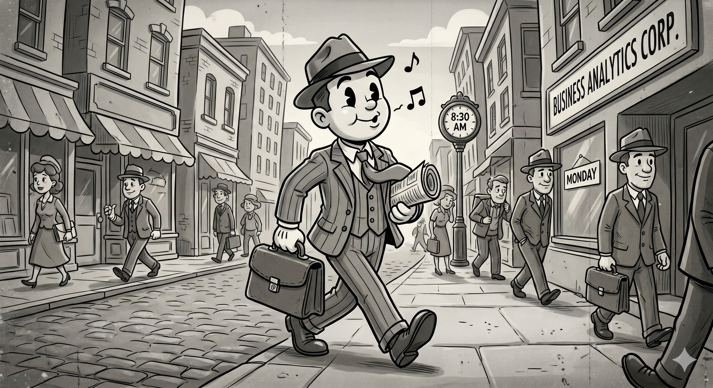
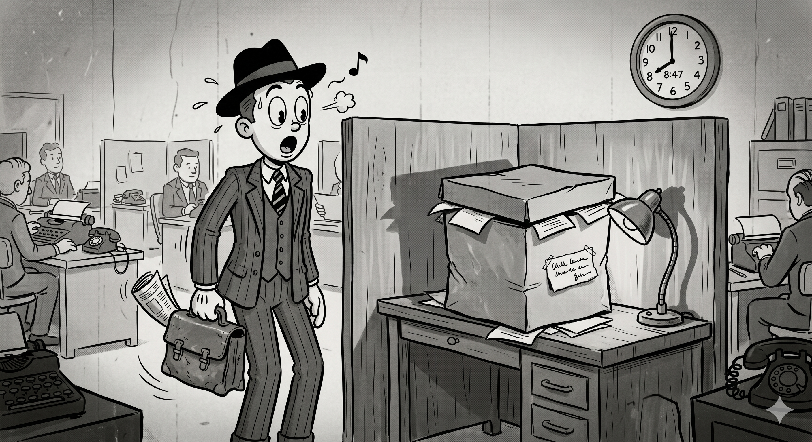
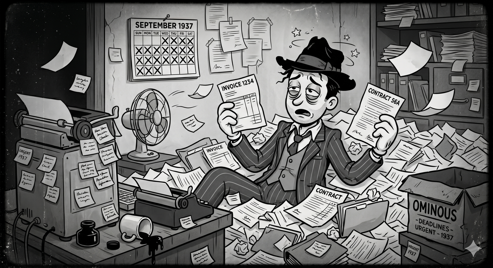
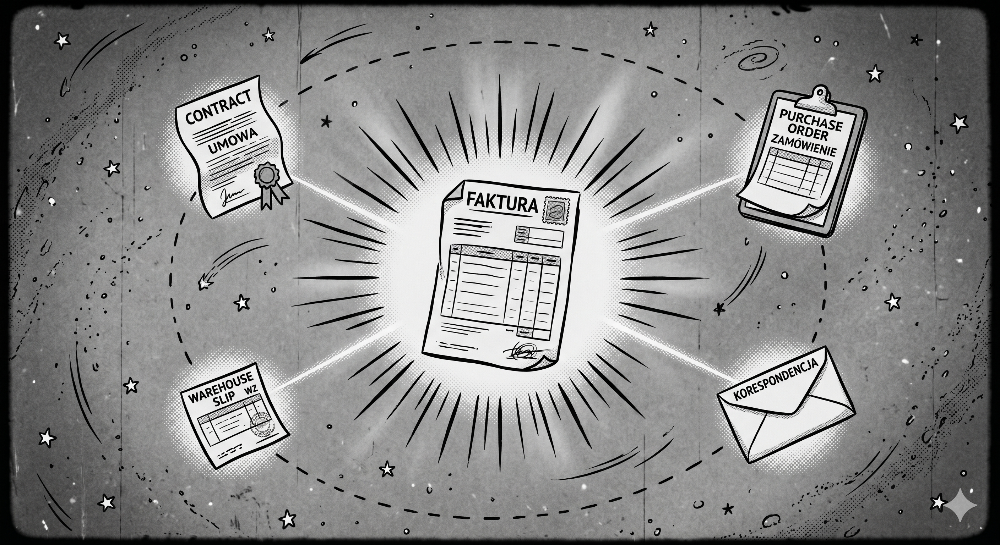
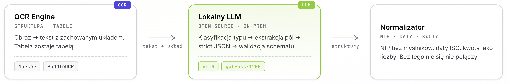
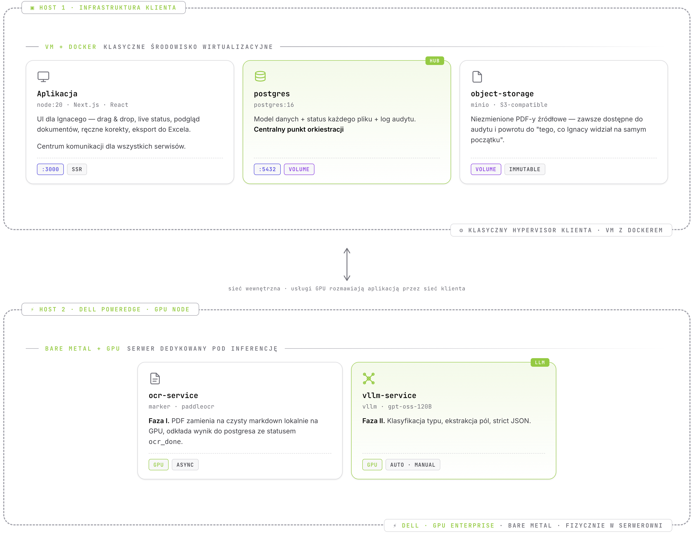
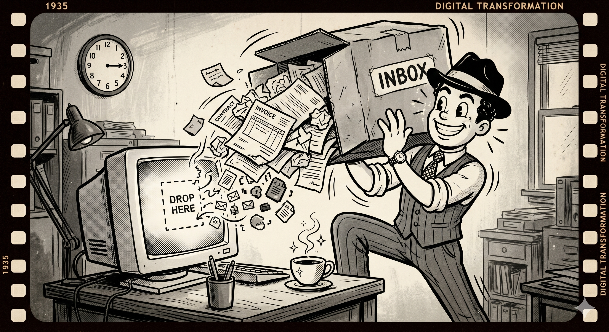
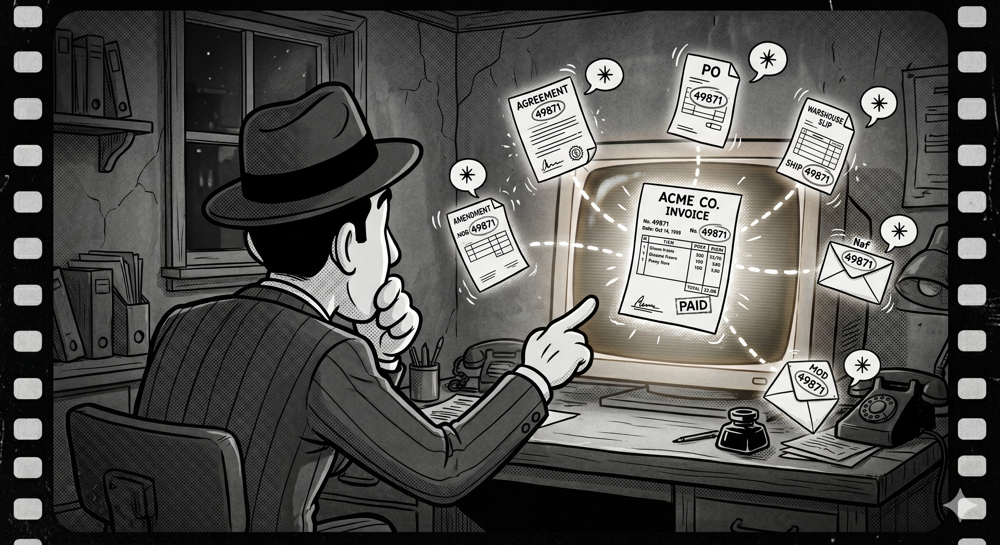
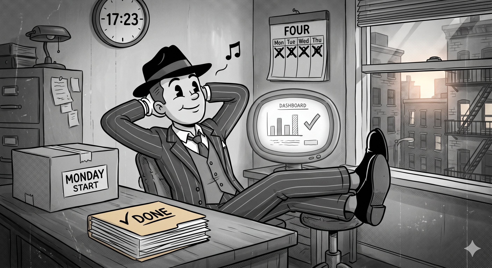

### Historia oparta na faktach

_Choć niektóre sceny i postacie mogą być zmyślone_

> _Notatka prowadzącego:_ Tu właśnie zaczyna się prezentacja. Jesteśmy na konferencji Dell Technologies, my występujemy jako partner. POC tego rozwiązania powstał na sprzęcie wypożyczonym od Della — wrócimy do tego mocno w drugim akcie. Aplikacja istnieje, jest skończona, jest wdrożona produkcyjnie. Ale dziś nie chcę opowiadać o niej tak, jakbym czytał dokumentację techniczną. Chcę opowiedzieć historię. Bohater nazywa się Ignacy. Wymyśliłem go — ale jego problem jest jak najbardziej realny. Czas: około 20 minut. Mówię jedno zdanie tytułowe, robię pauzę. _"To, co za chwilę zobaczycie, naprawdę się wydarzyło — tyle że nie dokładnie tak. Bohatera nie ma. Pudła nie ma. Ale problem był jak najbardziej prawdziwy."_ Pauza. Przechodzę do Ignacego.

---

## Poznajcie Ignacego

### 24 lata. Analityk biznesowy.

To jego pierwszy poniedziałek na nowym projekcie.

Jeszcze nie wie, czego się spodziewać.

Gwiżdże, idąc do biura.
**Myśli, że to będzie dobry dzień.**

> _Notatka prowadzącego:_ Tu wprowadzam głównego bohatera. Mówię spokojnie, ciepło — jak narrator bajki. Ignacy to nie konkretna osoba, ale jego pokoleniowy profil jest bardzo realny: dwadzieścia parę lat, świeżo po studiach, pierwsza poważna praca, nawyk myślenia "to powinno być automatyczne". Dzisiaj jego dzień się zmieni. Zanim wejdzie do biura, jest jeszcze szczęśliwy. Dajcie mu chwilę.

---

## Akt I

### Poniedziałek, 8:47

Ignacy wchodzi do biura.

Na biurku wielkie **pudło**.

W środku **1840 plików**.

> _Notatka prowadzącego:_ Tu zwalniam. Krótkie zdania, długie pauzy. Niech widz sam sobie wyobrazi pudło. Niech sam sobie wyobrazi 1840 plików. Ja od razu zaznaczam jedną rzecz: nie powiem wam, co było napisane na etykiecie pudła. Nie powiem, dla kogo Ignacy pracuje. Nie powiem, w jakiej branży się to wszystko dzieje. Powiem tylko tyle, ile musicie wiedzieć, żeby zrozumieć, dlaczego ten system w ogóle musiał powstać. Ten "brak kontekstu" jest świadomy — i będę go pielęgnował przez całą prezentację. Po prostu nie mogę powiedzieć więcej.

---

## Akt I

### Co jest w pudle

- Faktury
- Umowy
- Zamówienia
- Dokumenty magazynowe
- Coś, co kiedyś było korespondencją
- Skany skanów skanów

Wszystko **luzem**.
Bez porządku.
Bez relacji.
Bez spisu treści.

> _Notatka prowadzącego:_ To jest świat, w którym Ignacy ma spędzić najbliższe trzy tygodnie. Skany skanów to nie jest metafora — to są dokumenty, które ktoś sfotografował telefonem, ktoś inny wydrukował, a jeszcze ktoś inny przeskanował z powrotem. Jakość bywa różna. Pieczątki nakładają się na cyfry. Faktury z różnych systemów ERP wyglądają zupełnie inaczej. Z tej masy trzeba zrobić **odpowiedź na pytanie**, którego treści, jak już zaznaczyłem, też wam nie zdradzę.

---

## Akt I

### A Ignacy to Zetka

Dla millennialsa to byłby po prostu **kiepski poniedziałek**.  
Wziąłby kawę. Sprawdził fejsa, wykop, highlightsy F1 a później  
otworzyłby Excela i wziął się za robotę.

Dla Ignacego to są **syzyfowe prace**.

> _Czemu nikt tego nie zautomatyzował?_

> _Notatka prowadzącego:_ Mrugnięcie do widza. Ignacy jest Zetką — pokoleniem, które dorastało w świecie, gdzie wszystko _powinno_ być automatyczne. Jeśli coś trzeba robić ręcznie, to znaczy, że ktoś po prostu jeszcze nie napisał odpowiedniego skryptu. Millennials by się zaciął, ponarzekał na slacku, ale w końcu by zrobił. Ignacy zadaje pytanie, którego millennials już nie zadaje: **"po co?"**. I to jest dokładnie to pytanie, które uruchamia nasz projekt. Bo Ignacy ma rację. Tego ręcznie nie powinno się robić.

---

## Akt I

### Po co

- Pliki zawierają dość **łatwą zagadkę** do rozwikłania
- Jednak odpowiedź jest **niemożliwa bez przeczytania ich wszystkich**
- Termin: **trzy tygodnie**

> _Notatka prowadzącego:_ Tu specjalnie zostawiam puste pole. Nie powiem, jakie to pytanie. Nie powiem, jakie są konsekwencje. Wyobraźnia widza dorobi resztę. To jest mocniejsze niż jakikolwiek konkret. Każdy w sali, kto kiedyś dostał termin, którego nie dawało się dotrzymać uczciwie, w tej chwili kiwa głową. Ignacy ma trzy tygodnie. To bardzo mało. To bardzo dużo. To zależy od tego, czy ma narzędzia.

---

## Akt I

### Jak się to robi bez asysty AI

- Przeglądanie PDF-ów strona po stronie
- Karteczki na monitorze
- Pilnowanie Excela rosnącego w nieskończoność
- Powrót do tego samego pliku po raz piąty
- Brak możliwości poproszenia o pomoc kolegów z zespołu

**Tygodnie pracy. Dni przeglądania. Godziny szukania kilku istotnych liczb.**

> _Notatka prowadzącego:_ To jest świat sprzed naszej aplikacji. I tu nie ma żadnej przesady. Tak właśnie wygląda praca analityczna nad masą dokumentów. Wszyscy w branży to znają — niezależnie od tego, w jakiej dokładnie branży się to dzieje. Karteczki na monitorach to nie jest stereotyp. To jest stan faktyczny w 2026 roku, w bardzo wielu organizacjach. I to też jest punkt, w którym zaczyna się nasza inżynierska część historii.

---

## Pytanie projektowe

### Co właściwie musi zrobić aplikacja?

1. **Zjeść** stos PDF-ów dowolnej jakości
2. **Zrozumieć** co jest w środku każdego pliku
3. **Powiązać** ze sobą dokumenty
4. **Pokazać** wyniki tak, żeby Ignacy mógł im zaufać lub zakwestionować
5. **Umożliwić** współpracę i audytowalność
6. **Nic nie może wyjść** poza serwerownię

> _Notatka prowadzącego:_ To jest moment, w którym przełączam się z trybu opowieści na tryb inżynierski. Bardzo wyraźnie. Z tych pięciu wymagań cztery pierwsze są trudne, ale zrozumiałe. Każde "AI startup" obiecuje pierwsze cztery. Piąty wymóg — "nie wyjść poza serwerownię ani na sekundę" — jest tym, co odróżnia ten projekt od 99% rzeczy, które dziś nazywa się "AI workflow". Tu wchodzimy w drugi akt.

---

## Akt II

### "Mogliśmy wziąć chat GPT."

Dane nie mogą opuścić serwerowni.  
To jest **nienegocjowalne**.

Siła takich rozwiązań drzemie nie w gołym modelu ale **integracji** i **customowym podejściu** do zastanego problemu.

> _Notatka prowadzącego:_ Mocny moment. To jest punkt, w którym projekt mógł się zakończyć — albo wystartować na poważnie. Większość dzisiejszych "AI playbooków" zakłada chmurę i wywołania do API gdzieś na drugim końcu świata. My musieliśmy zbudować coś, co działa **bez chmury w ogóle**. Bez Internetu. Bez wyjścia. Bez żadnego "tymczasowego rozwiązania". I to nie było tak, że ktoś przyszedł i powiedział "fajnie by było". To był wymóg twardy. Bo dane, z którymi pracujemy, są tego typu, że ich nawet anonimizować nie wolno wynosić. Zostają tam, gdzie są. Kropka.

---

## Akt II

### Filozofia: jeden węzeł, wokół niego planety

**Faktura** to nasza gwiazda.

Wszystko inne — umowa, zamówienie, dokument magazynowy, korespondencja — **istnieje po to, żeby fakturę opisać**.

To nie jest tylko nasza estetyka.
To jest **struktura modelu danych w bazie**.
Każdy inny dokument w systemie wie, _do której faktury się odnosi_.

> _Notatka prowadzącego:_ Wybór "co jest centrum modelu" determinuje całą resztę architektury. Mogliśmy potraktować wszystkie dokumenty równorzędnie — i wtedy AI musiałby się domyślać, co jest ważne. My wybraliśmy inną drogę. Faktura jest słońcem, inne dokumenty są planetami, które wokół niej krążą. AI nie musi się domyślać, co ma robić — wie, że jego zadaniem jest **obudować fakturę kontekstem**. To jest cała filozofia, w jednym zdaniu.

---

## Architektura

### Pięć warstw, jeden deployment

1. **Ingest** — drag & drop + asynchroniczny worker pool
2. **OCR** — silnik obsługujący wielokolumnowe układy i tabele
3. **Ekstrakcja LLM** — lokalny model open-source, strict JSON output
4. **Indeksowanie** — pełnotekstowa wyszukiwarka + storage obiektowy
5. **Warstwa analityczna** — wiązanie, triangulacja, EDA, audyt, eksport

> _Notatka prowadzącego:_ To jest pierwszy twardy slajd techniczny i chcę go zostawić na chwilę dłużej. Pięć warstw, każda ze swoim constraintem. Stack świadomie konserwatywny — Next.js + React na froncie, modularny backend, worker pool oddzielony od API, lokalny LLM open-source jako mózg. I to wszystko zapakowane w kontenery. Deployment to dosłownie jedno polecenie. Sprzęt — Dell. Tu chcę powiedzieć wyraźnie: **bez sprzętu klasy enterprise z odpowiednim GPU pod ręką ten projekt nie wystartowałby**. Lokalny LLM nie odpali się na zwykłym serwerze biurowym. Dell wypożyczył nam fizyczny serwer, postawiliśmy go w serwerowni odbiorcy — i dopiero wtedy POC mógł się zacząć.

---

## Architektura

---

## Architektura

### Wszystko w kontenerach.

Jeden `docker compose up` w serwerowni odbiorcy.

---

---

## Architektura

**serwer Dell z GPU klasy enterprise**, fizycznie postawiony w lokalizacji odbiorcy.

---

## Architektura

---

## Warstwa Ingest

### Ignacy upuszcza pliki

Drag & drop — **całe pudło wjeżdża do systemu w jednym geście**.

Każdy plik trafia do **kolejki przetwarzania** z własnym cyklem życia:
`pending → analyzing → analyzed → failed`

Worker pool podejmuje pracę **asynchronicznie**.

Ignacy idzie po ka... spać.

> _Notatka prowadzącego:_ Wydaje się banalne. Nie jest. Synchroniczny upload przy 1840 plikach zabiłby UX i prawdopodobnie też serwer. Tu mamy klasyczny pattern: worker pool + queue + statusowy lifecycle każdego pliku. Skalujemy poziomo — dokładamy worker procesy, jeśli obciążenie rośnie. Status każdego pliku widać na żywo w UI. To jest fundament całej dalszej pracy, bo Ignacy nie ma czasu czekać na backend.

---

## Warstwa OCR

### Pierwszy przystanek

Faktury z różnych ERP-ów — **każda inny układ**.  
Pieczątki nakładające się na kwoty.  
Tabele, których nie chcemy "spłaszczyć".  
Skany skanów skanów.

Większość silników czyta od lewej do prawej.  
[OCR Benchmarks](https://www.codesota.com/ocr)

> _Notatka prowadzącego:_ OCR brzmi jak rozwiązany problem. Nie jest. Większość bibliotek OCR daje wam strumień tekstu, w którym kolumny są spłaszczone, tabele są pomieszane, a pozycja każdego elementu jest stracona. Dla naszego zastosowania to katastrofa. Faktura ma układ — i ten układ niesie informację. "Ta liczba w prawym dolnym rogu, w kolumnie 'do zapłaty'" to **inna informacja** niż ta sama liczba gdziekolwiek indziej. Wybraliśmy silnik OCR, który tę strukturę zachowuje. To było jedna z trudniejszych decyzji w stacku.

---

## Warstwa Ekstrakcja

### Jak?

- Lokalny model open-source dostaje tekst dokumentu + opisaną strukturę odpowiedzi
- Wyjście to **strict JSON** — walidowany schematem
- **Klasyfikacja typu** dokumentu
- Normalizacja w locie: NIP bez myślników, daty ISO, kwoty jako liczby

Bez normalizacji nic automatycznie nie połączymy.

> _Notatka prowadzącego:_ To jest serce systemu. LLM dostaje cały tekst dokumentu plus precyzyjny prompt z opisem, jakie pola ma wyciągnąć. Wyjście to JSON walidowany schematem — jeśli model halucynuje strukturę, łapiemy to od razu i robimy retry. Klasyfikacja typu jest osobnym krokiem przed ekstrakcją, bo zupełnie inne pola wyciągamy z umowy, a inne z zamówienia. Normalizacja: bez niej żaden NIP "1234567890" nigdy by się nie zmatchował z "123-456-78-90". Brzmi błaho — jest fundamentalne. Cała ekstrakcja działa na lokalnym modelu. Żaden tekst dokumentu nie wychodzi poza serwerownię. Ani jeden token.

---

## Magiczny moment

### Papier zaczyna ze sobą rozmawiać

Ignacy wpisuje **jeden numer zamówienia** w wyszukiwarce.

I nagle 1840 plików pokazuje mu, że ta sama liczba kryła się
w **siedmiu z nich**:

- w fakturze
- w zamówieniu
- w dokumencie magazynowym
- w trzech kolejnych mailach, których nie miał nawet w tej samej teczce
- w aneksie do umowy, o którym nie wiedział

**Stary świat: tydzień szukania.**
**Nowy świat: dwie sekundy.**

> _Notatka prowadzącego:_ To jest moment, na który czeka cała publiczność. Demo działa, AI działa, ale dopóki nie pokażesz, co to **naprawdę zmienia w dniu pracy Ignacego**, nikt tego nie poczuje. Otóż zmienia to **wszystko**. Bo dokumenty przestają być pojedynczymi plikami. Zaczynają być **siecią**. Wyszukiwarka po pełnej treści to dla wielu osób w sali będzie "Ctrl+F na sterydach", ale w naszej domenie to jest narzędzie, które dosłownie skraca tygodnie pracy do sekund. I dla Ignacego — Zetki, która nie znosi syzyfowych prac — to jest ten moment, w którym aplikacja zdobywa jego zaufanie.

---

## Warstwa Analityczna

### Triangulacja: trzech świadków

Ta sama wartość — pochodząca z **trzech niezależnych źródeł**.

| Źródło          | Co dostarcza            |
| --------------- | ----------------------- |
| Faktura         | Wartość X               |
| Umowa           | Wartość X (niezależnie) |
| Zlecenie zakupu | Wartość X (niezależnie) |

Wszystkie się zgadzają? **Wysoka pewność.**  
Jedno odstaje? **Flaga do ręcznej weryfikacji.**

Niepewność jest **cechą systemu**, nie błędem.

> _Notatka prowadzącego:_ Triangulacja to jeden z najmocniejszych mechanizmów w tym systemie. Nie ufamy jednemu źródłu, choćby to było AI. Bierzemy tę samą wartość — i sprawdzamy ją w trzech niezależnych miejscach. Trzech świadków zeznaje to samo — możemy spać spokojnie. Jeden zeznaje co innego — to jest sygnał, że trzeba dokładnie spojrzeć. To architektura, w której **niepewność nie jest brzydką tajemnicą, którą się ukrywa, tylko cechą, którą się wyświetla**. W tym świecie Ignacy nie pyta "czy AI miało rację" — pyta "czy źródła się zgadzają". To bardzo różne pytanie.

---

## Kontrola jakości

### Ignacy wie, gdzie patrzeć

Po przetworzeniu 1840 plików widzi **gdzie zacząć weryfikację**

Moduł EDA (Exploratory Data Analysis) pokazuje:

- W ilu dokumentach dane pole zostało wyekstrahowane poprawnie
- Filtrowanie po typie dokumentu + brakujących polach
- _"Mam 235 faktur. W 23 brakuje kluczowego pola."_

Ignacy **nie przegląda 235 faktur**.
Przegląda **23**.
Otwiera je, sprawdza, uzupełnia ręcznie — z poziomu listy braków.

> _Notatka prowadzącego:_ To jest moim zdaniem najbardziej niedoceniany komponent w systemach AI. Większość firm pokazuje "AI wyekstrahowało dane" i kończy temat. My idziemy o krok dalej: **AI mówi nam też, gdzie _nie_ wyekstrahowało**. To zmienia całą dynamikę pracy. Ignacy nie sprawdza wszystkiego. Sprawdza tylko miejsca, w których system sam się zgłosił, że ma wątpliwości. To jest różnica między "AI jako wyrocznia" a "AI jako współpracownik". My idziemy w to drugie.

---

## Audytowalność

### Wynik bez historii to plotka

Każde pole w systemie ma **trzy informacje meta**:

- Czy wartość pochodzi z **AI**, czy z **ręcznej edycji**
- **Kto** edytował (jeśli ręcznie)
- **Kiedy** edytował i jaka była poprzednia wartość

W procesach, gdzie konsekwencje są poważne, nie wystarczy _"wynik AI"_.
Musisz móc pokazać **jak ten wynik powstał**.

**Wynik z historią to dowód.**

> _Notatka prowadzącego:_ To jest wymóg, który w wielu dzisiejszych "AI apps" jest dodatkiem na końcu. U nas to jest fundament. W naszej domenie — i tu znów nie powiem dokładnie, jaka to domena — pojedyncza pomyłka może mieć poważne konsekwencje. Trzeba **zawsze** móc pokazać, skąd dana wartość się wzięła. Czy to AI, czy człowiek. Jeśli człowiek — to który. Jeśli zmienił coś, co AI wcześniej zaproponowało — to też widać. To nie jest "extra feature". To jest warunek dopuszczenia tego systemu w ogóle.

---

## Integracja

### Ignacy wraca do tego, co zna

Eksport do **Excela** w tym samym formacie, w którym pracował od pierwszego dnia.

Każdy wiersz **wzbogacony** o kolumny z metadanymi z AI.  
100% dopasowanie po **numerze dokumentu + NIP**.

Filozofia:

> Nie zmuszamy nikogo do migracji.  
> Wspomagamy istniejący workflow.  
> **Pokazujemy, że można inaczej**

> _Notatka prowadzącego:_ Pułapka, w którą wpada wiele "AI-first" produktów: zakładają, że użytkownik porzuci dotychczasowe narzędzia i pokocha nowy interfejs. Tak się nie dzieje. Excel jest sercem analizy w bardzo wielu organizacjach od trzydziestu lat i nie zniknie ani przez kolejne trzydzieści. Nasza aplikacja nie próbuje wyrzucić Excela — eksportuje wyniki w formacie, który płynnie wpina się w arkusz, z którym Ignacy pracował od pierwszego dnia. To zmienia adopcję radykalnie. Z _"muszę się uczyć nowego narzędzia"_ na _"moje stare narzędzie nagle wie więcej"_.

---

## Akt III

### Piątek, 17:23

Ignacy patrzy na biurko.

Pudło wciąż stoi a w nim 1840 plików.

Ale w przeglądarce — **raport**.  
W Excelu — wszystkie wiersze **wzbogacone**.  
W systemie — **ślad każdej decyzji**.

Termin: trzy tygodnie.
Czas faktyczny: **cztery dni**.

> _Notatka prowadzącego:_ Klamra narracyjna. Wracamy do tej samej sceny, którą zaczęliśmy — biurko, pudło, Ignacy. Tylko czas się zmienił. Z poniedziałku rano na piątek po południu. Z "trzech tygodni" na "cztery dni". I to jest cała wartość biznesowa tego systemu w jednym slajdzie. Nie zmieniliśmy fundamentalnie tego, co Ignacy robi. Zmieniliśmy tempo, w jakim może to robić. I dokładność. I audytowalność. Ale fundamentalna struktura jego pracy — ona pozostała. Bo Ignacy nie był problemem. Problemem było narzędzie.

---

## Podsumowanie

### Trzy rzeczy do zapamiętania

1. **Constraint definiuje architekturę.**
   Wymóg "100% on-premise" zmienił wybór każdego komponentu w stacku.

2. **Sprzęt enterprise = warunek konieczny.**
   Bez serwera Dell z GPU stojącego fizycznie w serwerowni odbiorcy — ten projekt by nie powstał.

3. **AI wspomaga, człowiek decyduje.**
   Audytowalność, EDA i ręczne korekty są **równie ważne** jak sama ekstrakcja.

> _Notatka prowadzącego:_ Trzy rzeczy, które chciałbym, żeby zostały po tej prezentacji. Pierwsza — jeśli macie projekt z twardym constraintem, nie traktujcie go jak przeszkody. Traktujcie jak konstruktor: definiuje architekturę, jaką macie zbudować. U nas tym constraintem było on-premise. To zmieniło wszystko — i ostatecznie wzbogaciło projekt. Druga — partnerstwo software-sprzęt nie jest marketingiem. Bez fizycznego serwera Dell z GPU pod ręką nie odpalilibyśmy żadnego lokalnego LLM-a. To prawdziwa, fizyczna zależność. Trzecia — żeby AI naprawdę pomagało, musi się dać kontrolować. Inaczej jest wyrocznią, której nikt nie ufa. My zbudowaliśmy współpracownika, nie wyrocznię. I dlatego Ignacy z nim pracuje.

---

## Dziękuję

### Pytania?

> _Notatka prowadzącego:_ Otwieram Q&A. Pamiętaj: jeśli ktoś zapyta wprost "dla kogo to jest", odpowiedz spokojnie, że nie mogę zdradzić odbiorcy ze względów poufności, ale chętnie odpowiem na każde pytanie techniczne lub architektoniczne.
