### Comtegra Hub 2026

# Frontier u siebie

**Jakub Zboina** · Team Leader AI · Comtegra S.A.

> _Notatka prowadzącego:_ 18 minut. 25 slajdów. To znaczy ~40 sekund na slajd. Nie ma czasu na rozgrzewkę, wchodzimy od razu. Tytuł mówię na głos i robię pauzę: **"Frontier u siebie."** Nie "AI w chmurze". Nie "transformacja cyfrowa". Frontier, czyli to, co najlepsze, u siebie: na swoich blachach, w swojej serwerowni. To jest cała teza tej prezentacji i chcę, żeby padła w pierwszych dziesięciu sekundach. Reszta to dowód.

---

## Zacznijmy od zdania, które rok temu było żartem

### "Postawimy GPT u siebie."

Teraz to możliwe!   
Tylko z czym to się wiąże?   
Jakie "funkcje" powinien posiadać czat?  
Na co zwrócić uwagę?  
Na co być gotowym?  
Jak w ogóle oszacować czego będziemy potrzebowali?

Jeszcze niedawno rozmawialiśmy, jak bardzo *nie da się* tego zrobić.

**Dzisiaj to jest po prostu decyzja zakupowa.**  
**A wiadomo, że te najlepiej podejmuje się na podstawie danych.**

> _Notatka prowadzącego:_ Tu robię kontakt z salą. Prawie każdy na tej sali był na spotkaniu, na którym ktoś to powiedział. I wszyscy grzecznie zmienili temat. Bo w 2024 to naprawdę nie miało sensu: modele open-source były o klasę gorsze, sprzęt był nieosiągalny, a narzędzia nie istniały. Zmieniły się wszystkie trzy rzeczy naraz i to jest właśnie ta historia. Ton: lekki, trochę autoironiczny. **Nie** zaczynam od "AI zmienia świat". Zaczynam od tego, że coś, z czego się śmialiśmy, przestało być śmieszne.

---

## Jedna liczba

### Cztery miesiące

Tyle wynosi dystans między najlepszym modelem otwartym
a najlepszym zamkniętym na świecie.

> _Notatka prowadzącego:_ Jedna liczba, jedno zdanie, i **nie dopowiadam z niej żadnego wniosku**. To jest świadome. Sala sama zacznie liczyć, bo każdy ma w głowie jakiś swój obraz tego dystansu i dla większości "cztery miesiące" będzie zaskoczeniem mniejszym, niż się spodziewali. Niech z tym posiedzą. Mówię wolno, robię pauzę **dłuższą, niż jest mi wygodnie**, i przechodzę dalej. Wnioski przyjdą same, przez kolejne dwadzieścia minut, i będą ich, nie moje. Skąd liczba: Epoch AI mierzy dystans między open a closed na swoim indeksie zdolności; od stycznia 2026 trzyma się na poziomie średnio czterech miesięcy, około 8 punktów ECI. Jeśli chcę dorzucić jedno zdanie, to tylko takie, że **ten dystans nie rośnie**, trzyma się w przedziale trzech do sześciu miesięcy od ponad półtora roku. Ale to też jest fakt, nie morał. **[Sprawdź liczbę tuż przed konferencją. Epoch.ai/data-insights/open-closed-eci-gap]**

---

## Dowód 1. Jakość

### [artificialanalysis.ai](https://artificialanalysis.ai/#intelligence)

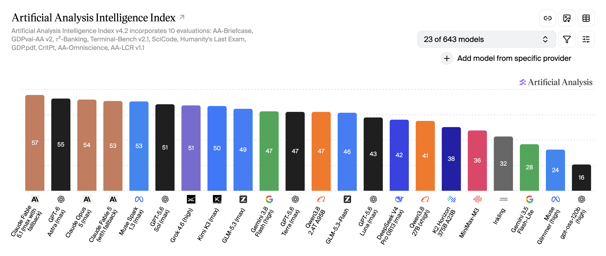

> _Notatka prowadzącego:_ Slajd, na którym nic nie mówię przez pierwsze trzy sekundy. Niech sala popatrzy. Potem prowadzę palcem po kolorach, bo to jest cała treść tego wykresu: **kolory zamknięte i kolory otwarte stoją wymieszane**. Brązowe to Anthropic, czarne OpenAI, i owszem, są na szczycie. Ale niebieski Kimi K3 i Z-owe GLM-5.3 wchodzą między nich, a nie za nimi. To nie jest wykres z dwiema grupami, to jest jeden ciąg. Dwie rzeczy do powiedzenia głośno: po pierwsze, każdy słupek od ósmego w prawo to model, który możecie mieć na własnym dysku. Po drugie, spójrzcie na sam koniec, gpt-oss-120b z wynikiem 16. **Otwarty nie znaczy dobry.** Wybór modelu wciąż ma znaczenie i to jest dokładnie ta robota, którą bierzemy na siebie. Jeśli gonię czas, ten slajd zajmuje trzydzieści sekund i nie tracę nic.

---

## Dowód 1. Jakość

### Gdzie realnie stoją modele otwarte, wrzesień 2026

| Model | Typ | Parametry (aktywne) | Index |
|---|---|---|---|
| Claude Fable 5.1 | zamknięty | *nieujawnione* | **57** |
| GPT-6 Astra | zamknięty | *nieujawnione* | 55 |
| **Kimi K3** | **open weights** | 2,8 bln (104 mld) | **50** |
| GLM-5.3 | open weights | 743 mld (40 mld) | 49 |
| GLM-5.3-Flash | open weights | 321 mld (18 mld) | 46 |

**Siedem punktów.**

Tyle dzieli najlepszy model, który *możesz* pobrać,
od najlepszego, którego *nie możesz*.

> _Notatka prowadzącego:_ Kluczowe słowo: "pobrać". Pauza. Siedem punktów na skali, na której ostatni model w rankingu ma szesnaście. To nie jest przepaść, to jest zaokrąglenie. Jeśli ktoś zapyta o metodologię: Artificial Analysis Intelligence Index v4.2, agregat dziesięciu benchmarków: Humanity's Last Exam, Terminal-Bench, SciCode i siedem innych. Ma swoje wady, jak każdy agregat, ale jest najuczciwszym pojedynczym miernikiem, jaki mamy. Zwróćcie uwagę na trzecią kolumnę, bo to jest slajd w slajdzie. Przy modelach zamkniętych jest napisane **"nieujawnione"**, bo nikt na świecie poza dostawcą nie wie, jak duży jest ten model. Przy otwartych wiem co do miliarda. To jest różnica, która wygląda na ciekawostkę, a jest fundamentem wszystkiego, co powiem o AI Act: **nie da się udokumentować systemu, którego rozmiaru nie znasz**. Liczby w nawiasach to parametry aktywne. MoE liczy tylko ułamek modelu na każdy token, dlatego 2,8 biliona parametrów da się w ogóle uruchomić. **I zapamiętajcie wiersz GLM. 743 miliardy parametrów. Za trzy slajdy pokażę, ile miejsca zajmuje na karcie, a za pięć. Jak ten model zachowuje się pod obciążeniem na sprzęcie AMD.** Drobiazg dla dociekliwych: publiczny benchmark, który pokażę, jedzie na GLM-5.2, a 5.3 to ta sama baza 743 mld po dotrenowaniu, więc liczby wydajnościowe przenoszą się jeden do jednego. [Liczby z artificialanalysis.ai. Odśwież tabelę i zrzut w tygodniu konferencji.]

---

## Dowód 1. Jakość

### Co się właściwie zmieniło

- **MoE**: liczy się ułamek modelu → *obok*
- **FP4**: cztery bity zamiast szesnastu
- **Dojrzałe silniki**: vLLM i SGLang 
- **Gotowe kwantyzacje** - dbajmy o higienę 

Efekt: model klasy frontier **mieści się na 2–4 kartach**.

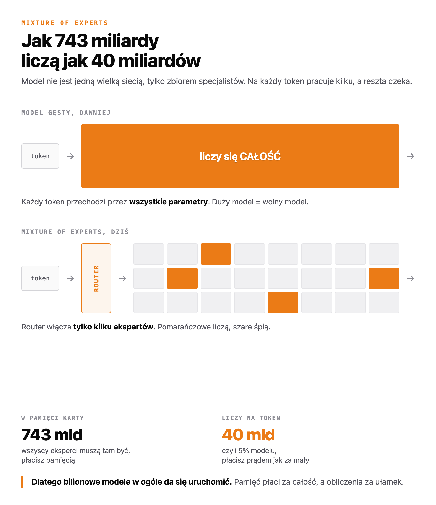

> _Notatka prowadzącego:_ Cztery hasła po lewej czytam szybko, prawie hasłowo. Nie zmienił się jeden przełom, tylko cztery rzeczy naraz. FP4 sprawił, że modele przestały być drogie w pamięci. Silniki dojrzały do produkcji. A ekosystem publikuje gotowe, sprawdzone kwantyzacje, więc nie musisz być ośrodkiem badawczym, żeby to uruchomić. **Zatrzymuję się dopiero na pierwszym haśle i pokazuję na grafikę po prawej**, bo to jedyna rzecz z tej czwórki, którą warto naprawdę zrozumieć. Dawniej każdy token przechodził przez cały model, więc duży model znaczyło wolny model. Dziś model jest zbiorem specjalistów, a mały router decyduje, którzy dwaj czy trzej mają się obudzić. **I stąd te dwie liczby na dole grafiki, które są sednem: 743 miliardy muszą leżeć w pamięci karty, ale tylko 40 miliardów faktycznie liczy na każdy token.** Pamięć płaci za całość, prąd płaci za ułamek. Jeśli ktoś zapyta "to czemu nie wyrzucimy nieużywanych ekspertów", to dlatego, że przy następnym tokenie router wybierze innych. Wszyscy muszą być pod ręką. To jest zdanie, które za chwilę wytłumaczy Wam, dlaczego kupujemy karty z tak dużą pamięcią. **[Kandydat do wycięcia, jeśli będzie ciasno, ale to najlepszy slajd edukacyjny w decku.]**

---

## Dowód 1. Jakość

### Skąd się bierze to „dwie–cztery karty"

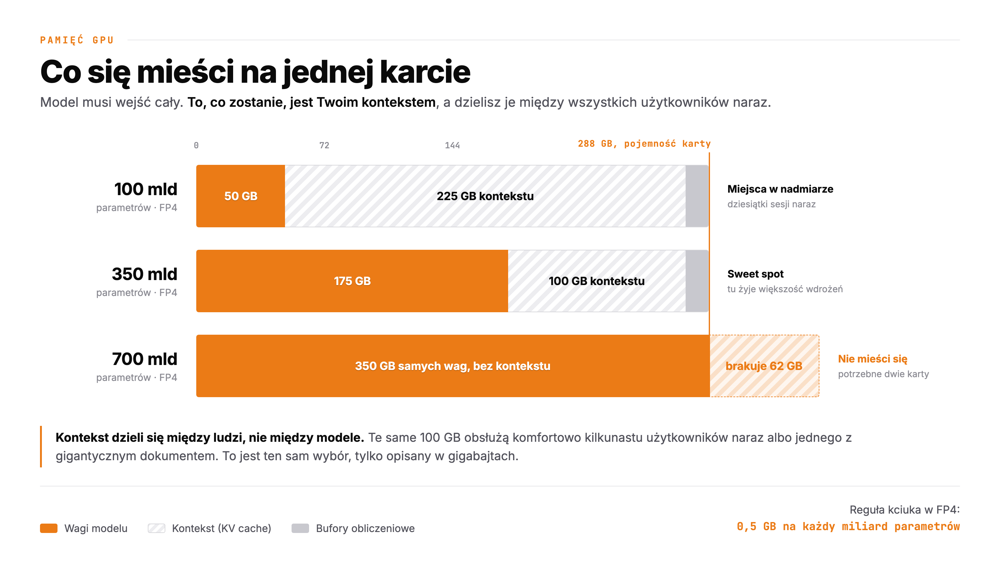

> _Notatka prowadzącego:_ Slajd, który tłumaczy całą ekonomię wdrożenia AI w trzech słupkach, więc daję mu minutę. Zasada jest jedna i mieści się w prawym dolnym rogu: **w FP4 pół giga na każdy miliard parametrów**. Model stumiliardowy to pięćdziesiąt gigabajtów i zostaje Wam mnóstwo miejsca. Model siedmiusetmiliardowy nie wchodzi w ogóle, bo same wagi przekraczają kartę i musicie kupić drugą. Ale najważniejszy jest ten zakreskowany obszar, czyli **kontekst**. To nie jest miejsce na model, tylko miejsce na rozmowy. I dzieli się je między wszystkich użytkowników naraz, więc im więcej ludzi pracuje jednocześnie, tym krótszą pamięć ma każdy z nich. Jeśli ktoś zapyta "czemu mój ChatGPT nie zapomina, a nasz model zapomina", odpowiedź jest na tym slajdzie. To też jest moment, w którym pada zdanie, które powtarzam od dwóch lat: **inferencja jest ograniczona pamięcią, nie mocą obliczeniową.** Za chwilę zobaczycie, co z tego wynika w praktyce.

---

## Ale

### Benchmark to nie Twój use case

Ranking mówi, **jak mądry** jest model.

Nie mówi:

- ile sekund czeka Twój użytkownik na pierwsze słowo
- ilu ludzi obsłużysz naraz, zanim zrobi się nieprzyjemnie
- ile kart musisz kupić, żeby to miało sens

**Więc zejdźmy z rankingów na sprzęt.**

> _Notatka prowadzącego:_ Zwrot akcji. Do tej pory były rankingi, teraz będą sekundy i tokeny na sekundę. To jest moment, w którym prezentacja przestaje być przeglądem rynku. Zapowiadam, czego będziemy szukać, bo to trzy pytania, które zadaje każdy, kto ma to kupić: **jak długo się czeka, ilu ludzi naraz, ile kart trzeba.** I zapowiadam źródło: nie moje slajdy, tylko publiczny dashboard, który każdy może otworzyć.

---

## Blachy

### HPE ProLiant Compute XD685.

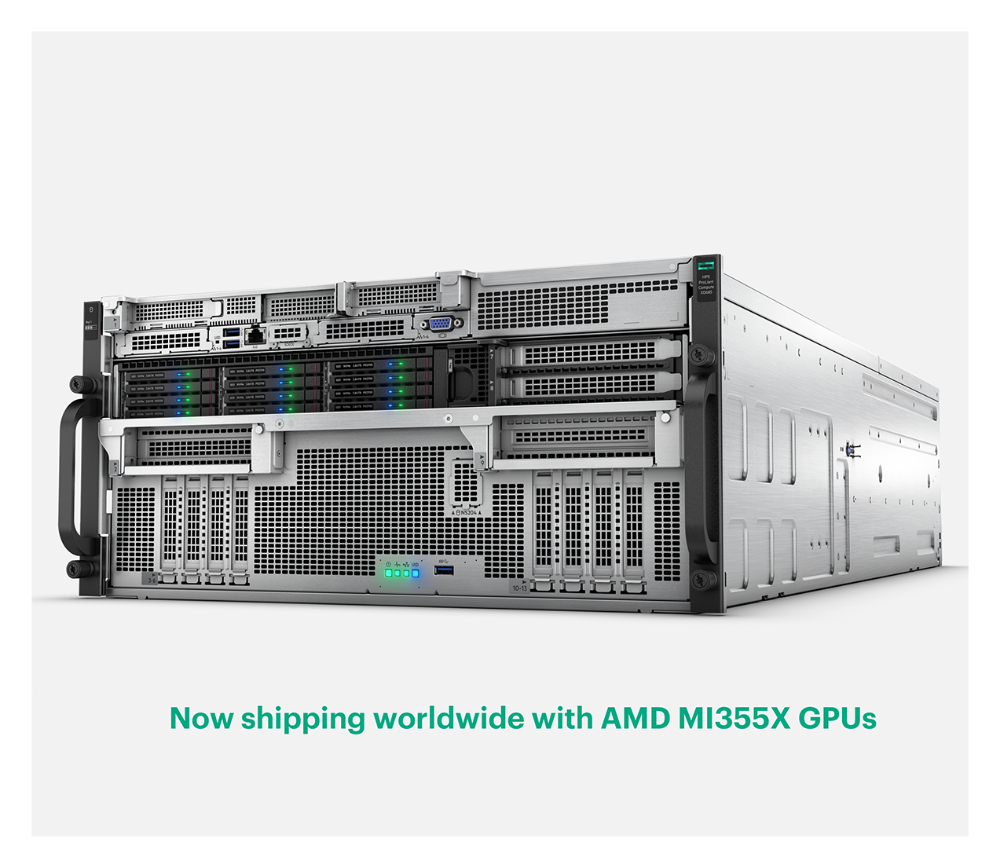

> _Notatka prowadzącego:_ Zanim pokażę liczby, pokazuję **rzecz**. Cztery jednostki wysokości, do ośmiu kart AMD Instinct w środku, dostępny od ręki. Nie prototyp, nie roadmapa, nie "zapytaj przedstawiciela w czwartym kwartale". Jedno zdanie, na które warto zwrócić uwagę sali, jest wydrukowane na dole obrazka: **now shipping worldwide**. Przez ostatnie trzy lata każda rozmowa o GPU kończyła się terminem dostawy, a nie ceną. To się właśnie zmieniło i to jest samodzielna wiadomość. Nasze pomiary, które za chwilę zobaczycie, robiliśmy na **czterech kartach**, czyli na połowie tego, co to pudło unosi.

---

## Dowód 2. Wydajność

### Sprawdziliśmy jak poradzi sobie GLM-5.2 na czterech MI355X

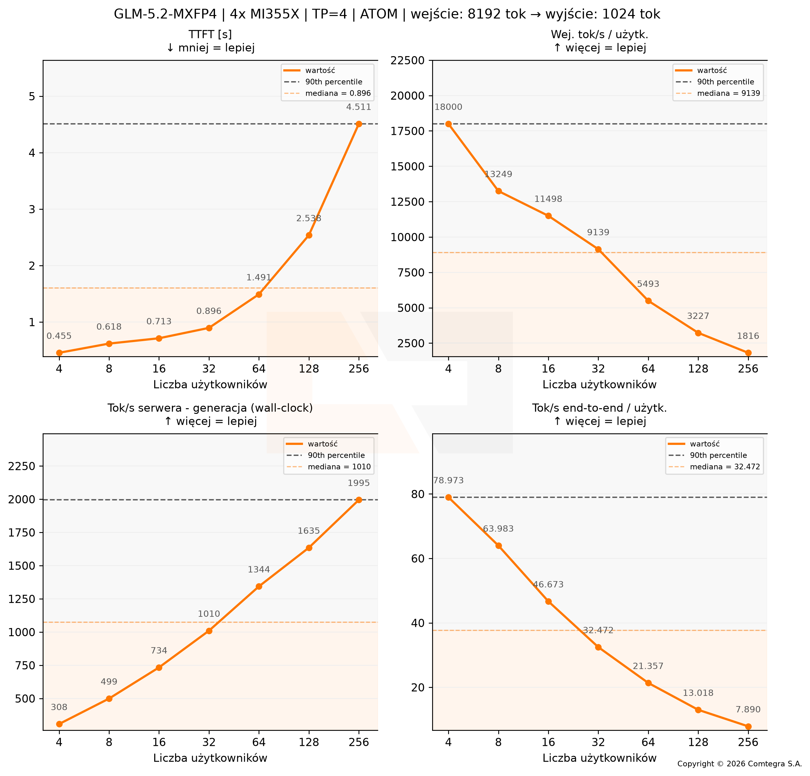

> _Notatka prowadzącego:_ Cztery wykresy, ale omawiam **dwa**. Reszta jest dla tych, którzy poproszą o slajdy. Lewy górny: **czas do pierwszego słowa**. Do trzydziestu dwóch równoległych użytkowników trzymamy się **poniżej sekundy**; przy stu dwudziestu ośmiu to dwie i pół sekundy, przy dwustu pięćdziesięciu sześciu. Cztery i pół. Krzywa jest płaska długo, a potem wystrzeliwuje, i to jest ważne, bo mówi, gdzie jest granica komfortu: **gdzieś koło sześćdziesięciu czterech**. Lewy dolny: przepustowość generacji rośnie z trzystu do dwóch tysięcy tokenów na sekundę. Warunki są wypisane w tytule i celowo nie są laboratoryjne: **osiem tysięcy tokenów wejścia, tysiąc wyjścia**, czyli wrzucasz dokument i dostajesz analizę, a nie "cześć, jak się masz". [Wykres: GLM-5.2-MXFP4, 4× MI355X, TP=4, backend ATOM.]

---

## Dowód 2. Wydajność

### Człowiek przeczyta 1–2% tych tokenów

Reszta to **rozumowanie modelu i wywołania narzędzi**.
Dlatego nie liczy się „szybciej, niż czytam", tylko **ile zadań na godzinę**.

| Równolegle | Na osobę | Jedno zadanie | Zadań/godz. |
|---|---|---|---|
| **16 agentów** | 47 tok/s | **7 min** | ~130 |
| 64 agentów | 21 tok/s | 16 min | ~245 |
| 256 agentów | 8 tok/s | 42 min | ~360 |

*Przy 20 tys. tokenów generowanych na jedno zadanie agenta.*

Powyżej 64 dokładanie agentów kupuje **mało przepustowości
i dużo czekania**.

> _Notatka prowadzącego:_ Tu zabijam metrykę, którą wszyscy powtarzają na konferencjach, łącznie ze mną rok temu: **„model generuje szybciej, niż człowiek czyta"**. To zdanie było prawdziwe w czasach czatu i jest bez znaczenia w czasach agentów, bo dziś człowiek czyta **jeden, może dwa procent** tego, co model wygenerował. Reszta to rozumowanie, plany, poprawianie się i wywoływanie narzędzi. Nikt tego nie czyta. **To jest praca, nie tekst.** Więc jednostką nie jest token na sekundę, tylko zadanie na godzinę. I taka jest ta tabela, przeliczona wprost z poprzedniego wykresu. Środkowy wiersz to miejsce, w którym bym siedział: sześćdziesiąt cztery zadania naraz, kwadrans na zadanie, dwieście czterdzieści pięć zadań z godziny. Dolny wiersz jest po to, żeby pokazać, że **dokładanie równoległości przestaje się opłacać**. Czterokrotnie więcej agentów daje niecałe pięćdziesiąt procent więcej roboty, za to czeka się trzy razy dłużej. Uczciwie: dwadzieścia tysięcy tokenów na zadanie to moje założenie, wypisane na slajdzie. U Was może być inne, ale proporcje między wierszami zostaną. **A teraz zdanie, dla którego istnieje ten slajd, powiedziane wolno: przy takim zużyciu tokenów rozliczanie się za token przestaje mieć sens. Agent, który myśli, jest bardzo drogim klientem cudzego API. I bardzo tanim mieszkańcem własnego serwera.**

---

## Dowód 2. Wydajność

### 1152 GB w jednym serwerze

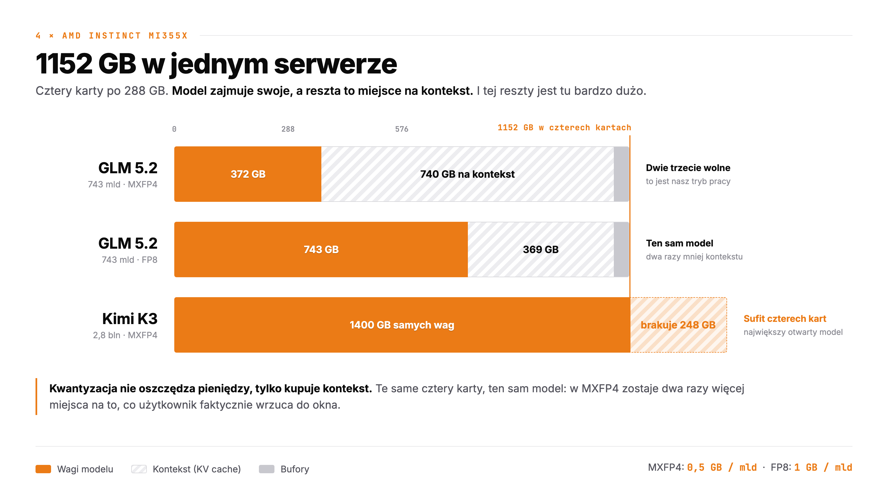

> _Notatka prowadzącego:_ Wracamy do tej samej grafiki co przy jednej karcie, tylko teraz mamy cztery. **1152 gigabajty w jednym pudle**. Górny słupek to nasz tryb pracy: GLM w czterech bitach zajmuje 372 GB, czyli jedną trzecią, a **dwie trzecie zostają puste**. Środkowy pokazuje, co się dzieje, gdy ktoś się uprze na FP8: ten sam model, ta sama jakość na oko, ale zajmuje dwa razy więcej i kontekst kurczy się o połowę. Stąd zdanie na dole, które warto powiedzieć wolno: **kwantyzacja nie oszczędza pieniędzy, ona kupuje kontekst.** Dolny słupek to uczciwość. Kimi K3, największy otwarty model świata, nie mieści się nawet tutaj. Sufit istnieje, tylko jest wysoko.

---

## Dowód 2. Wydajność

### 2,3 mln tokenów. Na co je wydasz?

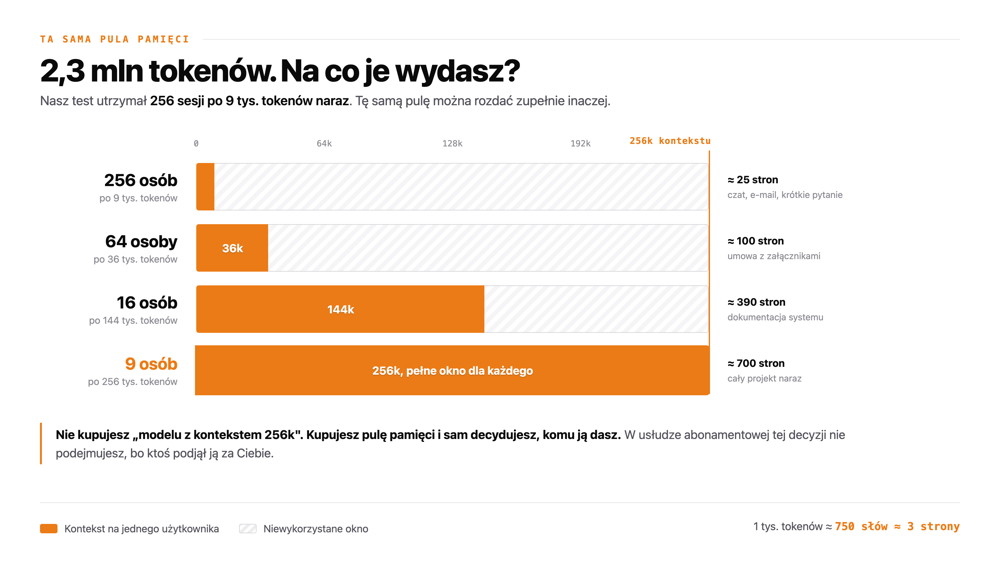

> _Notatka prowadzącego:_ Najważniejszy slajd tego bloku i chcę na nim zwolnić. W naszym teście serwer utrzymał dwieście pięćdziesiąt sześć sesji po dziewięć tysięcy tokenów. To jest **dwa i trzy dziesiąte miliona tokenów w locie naraz**, liczba zmierzona, nie wymyślona. I teraz uwaga: **to jest pula, nie sztywne ustawienie.** Tę samą pamięć możecie rozdać dziewięciu osobom po ćwierć miliona tokenów każda. Ćwierć miliona to jest **siedemset stron A4**. Cała dokumentacja projektu, wszystkie umowy z kontrahentem, kod całego repozytorium, wrzucone do jednego okna, bez dzielenia na kawałki, bez RAG-a, bez sztuczek. **My pracujemy właśnie w tym trybie. Minimum 256k.** I to nie jest zachcianka: agent z poprzedniego slajdu zapycha okno sam z siebie, bo każdy krok rozumowania i każda odpowiedź narzędzia zostają w kontekście. Nie potrzebujecie 256k, bo ktoś wrzuca wielkie pliki. Potrzebujecie ich, bo **agent pracujący przez godzinę sam sobie zapisuje tam całą historię pracy**. I stąd puenta: nie kupujecie "modelu z kontekstem 256k", kupujecie pulę pamięci i sami decydujecie, komu ją dacie. W abonamencie tej decyzji nie podejmujecie. Uczciwe zastrzeżenie, gdyby ktoś dopytał: przy tak długim kontekście spada przepustowość, bo uwaga kosztuje. Pamięć wystarcza, ale nie obiecuję tych samych tokenów na sekundę.

---

## Nasza produkcja

### A tak to wygląda naprawdę. Miesiąc ruchu w Comtegrze

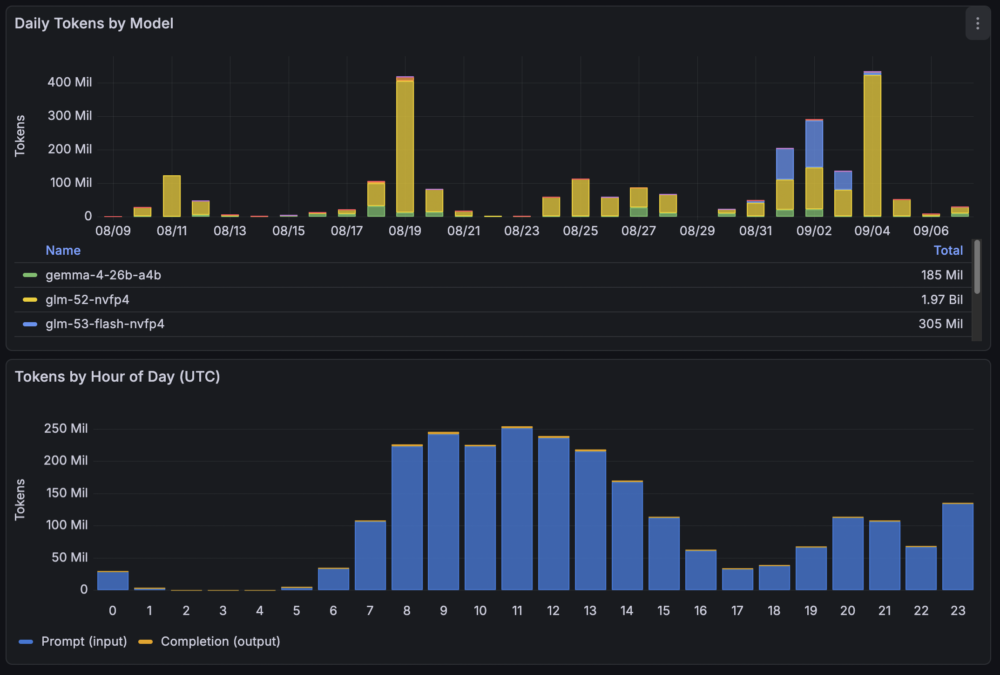

> _Notatka prowadzącego:_ Do tej pory były benchmarki. Teraz jest **rachunek za prąd**. To jest nasza Grafana, miesiąc, produkcja, prawdziwi użytkownicy. Dwie rzeczy pokazuję palcem. Górny wykres: **dwa i pół miliarda tokenów w miesiąc**, ze szpilkami po czterysta milionów w jednej dobie. To są dni, w których ktoś puścił porządną analizę. Dolny wykres jest ciekawszy i mówi coś, czego nie powie żaden benchmark: **to jest kształt dnia pracy**. Ruch startuje o ósmej UTC, szczyt koło jedenastej, spadek po piętnastej. To nie jest zabawka, do której ktoś zagląda wieczorem. To jest narzędzie, którego ludzie używają w godzinach pracy, między jednym mailem a drugim. **A teraz najważniejsze: widzicie ten cienki pomarańczowy pasek na samej górze niebieskich słupków? To jest wszystko, co model wygenerował.** Cała reszta to czytanie. O tym jest następny slajd. **[Kandydat do wycięcia. Jeśli goni czas, kształt dnia pracy da się powiedzieć jednym zdaniem przy następnym slajdzie, a proporcja i tak tam wraca.]**

---

## Nasza produkcja

### Czytamy 79 razy więcej, niż piszemy

Wejście: **2,49 mld** tokenów
Wyjście: **31,5 mln** tokenów

Na każdy token, który model **napisał**,
przypada **79 tokenów, które przeczytał**.

Nie kupujemy prędkości generowania.
**Kupujemy miejsce na kontekst.**

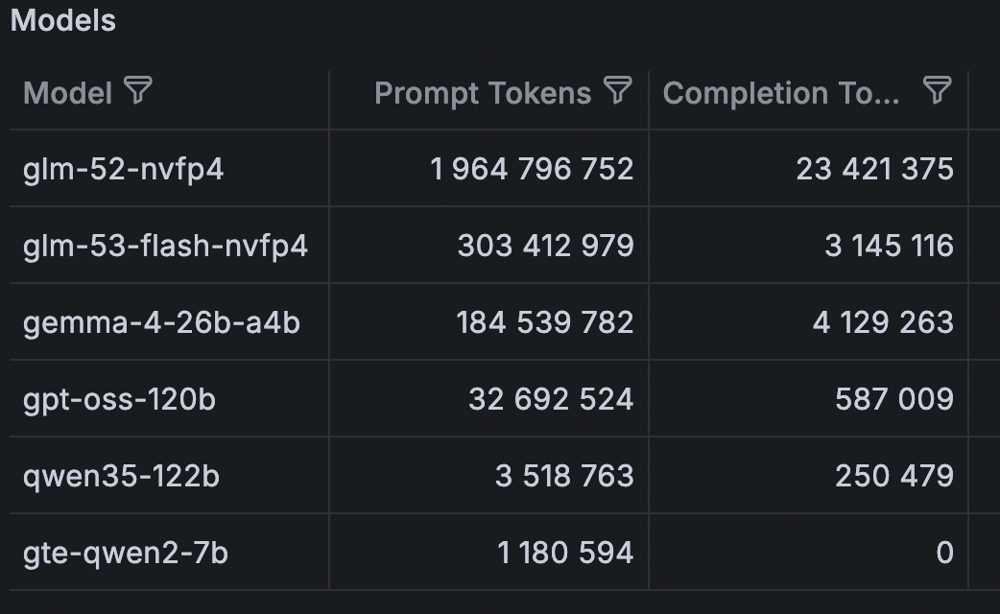

> _Notatka prowadzącego:_ To jest slajd, który spina cały ten blok, i chcę na nim zwolnić. Popatrzcie na te dwie kolumny: prawie **dwa i pół miliarda** tokenów wejścia, **trzydzieści jeden milionów** wyjścia. Stosunek siedemdziesiąt dziewięć do jednego. Przy naszym głównym modelu osiemdziesiąt cztery do jednego, przy Flashu. Dziewięćdziesiąt sześć. **AI w firmie nie pisze. AI czyta.** Czyta umowy, logi, dokumentację, kod, maile, faktury. I z tego robi kilka zdań odpowiedzi. To jest cała prawda o tym, jak wygląda produkcyjne obciążenie, i dlatego jest ostatnia linijka: prędkość generowania to nie jest wąskie gardło. **Wąskim gardłem jest to, ile da się wrzucić do okna**, czyli dokładnie to, o czym mówiłem dwa slajdy temu przy 256k. Uczciwe zastrzeżenie, gdyby ktoś porównał slajdy: benchmark jechał w proporcji osiem do jednego, a produkcja pracuje w siedemdziesiąt dziewięć do jednego. To znaczy, że **realny ruch jest jeszcze bardziej głodny kontekstu**, niż to, co zmierzyliśmy. Drobiazg na dole tabeli, gdyby ktoś zapytał: `gte-qwen2` ma zero wyjścia, bo to embedder. On tylko czyta, z definicji.

---

## Nasza produkcja

### Prompty dobijają do 100 tysięcy. Odpowiedzi mają setki.

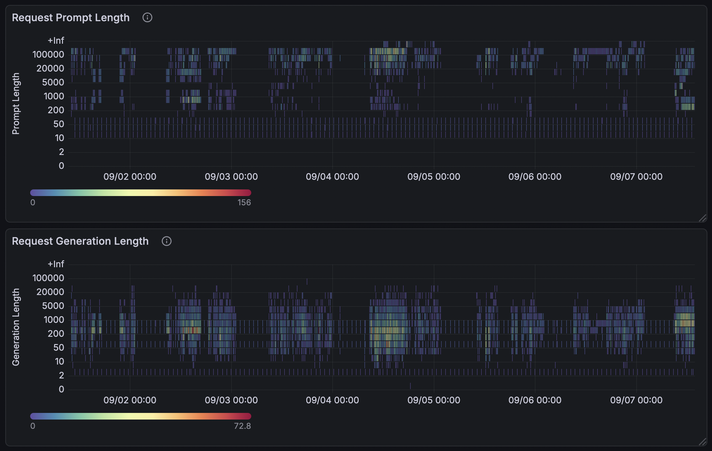

> _Notatka prowadzącego:_ Ostatni slajd tej części i najmocniejszy, bo pokazuje **rozkład, a nie średnią**. A średnia zawsze kłamie. Górna mapa to długość tego, co ludzie wrzucają. Skala jest logarytmiczna, więc patrzcie na wysokość: **główna masa siedzi między dwadzieścia a sto tysięcy tokenów**, a nad nią jest wyraźne, regularne pasmo, które **przebija sto tysięcy i wchodzi w plus nieskończoność**, czyli w naszą górną granicę pomiaru. To nie są wyjątki raz w tygodniu. To jest codzienność, widać ją w każdej dobie na tej mapie. Dolna mapa to długość odpowiedzi: gorący obszar między **dwieście a tysiąc tokenów**, czyli akapit, może dwa. **I to jest ta sama historia co poprzedni slajd, tylko pokazana uczciwiej.** Teraz można powiedzieć zdanie, które domyka cały ten blok: kiedy ktoś pyta, po co nam kontekst dwieście pięćdziesiąt sześć tysięcy, odpowiedź nie brzmi „na przyszłość". Odpowiedź brzmi: **bo dzisiejszy ruch już dobija do stu tysięcy, a 256k to po prostu następny rozmiar w górę.** Ta cienka linia na samym dole górnej mapy, koło dziesięciu tokenów, o którą ktoś na pewno zapyta, to health-checki. System sam siebie odpytuje.

---

## Nad modelem

### Tu zaczyna się najciekawsza część

Sam model **przewiduje tekst**.  

Harness dokłada mu dwie rzeczy, które zmieniają wszystko:

**Pisze kod i go uruchamia.**
Nie opisuje, jak coś policzyć tylko  po prostu liczy.
Znajdzie błąd, poprawi się i spróbuje jeszcze raz.

**Pamięta.**
Nie tylko w oknie czatu. Po tygodniu wie,
jak wyglądają pliki, jakie projekty realizowaliśmy czy z kim rozmawialiśmy.

> _Notatka prowadzącego:_ Ton się tu zmienia i to jest zamierzone. **Koniec z dowodami, zaczynamy się dobrze bawić**. Do tej pory było o blachach i liczbach. Teraz o tym, co się dzięki nim da zrobić, i chcę, żeby to było słychać w głosie. Sedno slajdu to punkt pierwszy, bo on jest naprawdę niedoceniany: **model, który potrafi uruchomić kod, przestaje być rozmówcą, a staje się wykonawcą**. Zapytany o sumę w arkuszu nie zgaduje. Pisze trzy linijki, uruchamia je, czyta wynik. Dostanie błąd? Czyta treść błędu i poprawia. Ta pętla (napisz, uruchom, przeczytaj, popraw) jest tym samym, co robi programista, tylko trwa sekundy. **To jest ten skok, po którym asystent zaczyna dowozić robotę, a nie akapity.** Punkt drugi to pamięć, i tu warto podać ludzki przykład: po tygodniu pracy agent wie, że faktury leżą w tym katalogu, że format daty jest odwrotny i że Kowalski chce raport w piątek. Nie trzeba mu tego powtarzać. **I ostatnia linijka, powiedziana z uśmiechem: to nie jest ładniejszy czat.**

---

## Use case

### Hermes Agent

Otwarty agent od **Nous Research**. Licencja MIT.
Jeden z najszybciej rosnących projektów agentowych na GitHubie.

- Pamięć **trwała**. Pamięta między sesjami, nie tylko w oknie czatu
- **Sam pisze sobie umiejętności** po wykonaniu złożonego zadania
- Wchodzi tam, gdzie ludzie już są: **Sharepoint, CRM, ERP, Teams, surowe bazy danych, serwery aplikacyjne, klastry Kubernetes**

> _Notatka prowadzącego:_ To jest gwóźdź programu i daję mu spokojną minutę. Nie budujemy agenta od zera. Bierzemy gotowy, dojrzały, otwarty projekt. Najciekawsza rzecz to punkt drugi: Hermes po wykonaniu skomplikowanego zadania **zapisuje sobie procedurę jako umiejętność** i następnym razem robi to szybciej i taniej. To jest agent, który po trzech miesiącach w organizacji jest realnie lepszy niż w dniu wdrożenia. Punkt czwarty jest niedoceniany: nikt nie będzie chodził na nową stronę. Agent musi być na Slacku, na Teamsach. Tam, gdzie ludzie już siedzą.

---

## Use case

### Ten sam agent. Inny dostawca modelu.

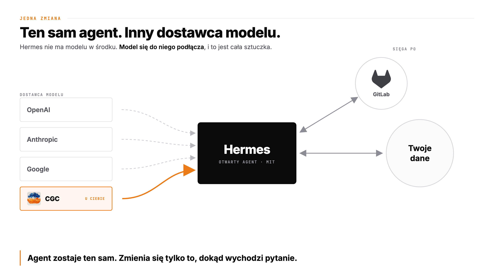

> _Notatka prowadzącego:_ Ten slajd czyta się sam, więc mówię mało i wolno. Hermes **nie ma modelu w środku**. Model się do niego podłącza. Możecie go wpiąć w OpenAI, w Anthropic, w Google. Trzy szare, przerywane strzałki. Albo w model stojący w CGC, i to jest ta czwarta, pomarańczowa. **Agent jest dokładnie ten sam. Kod jest ten sam. Zmienia się jedna linijka konfiguracji.** Nie pokazuję jej na slajdzie, bo nie o linijkę tu chodzi, ale jeśli ktoś zapyta na stoisku: to jest jedna komenda, `hermes model`, wskazanie endpointu, koniec. Po prawej jest kółko z napisem "Twoje dane" i celowo nie napisałem, co w nim jest, bo u każdego na tej sali jest tam coś innego, i każdy właśnie sobie to podstawił. **A nad nim jest jedno źródło nazwane po imieniu: GitLab.** To jest zaczepka i ma taka być, bo w tym momencie połowa sali zrozumie, że mówimy o ich repozytoriach. **[TU WCHODZI TWOJA HISTORIA O GITLABIE. Opowiedz ją tutaj, slajd jest pod nią przygotowany.]** **A teraz zdanie, dla którego zrobiłem ten obrazek: przy trzech pierwszych opcjach pytanie razem z tymi danymi wychodzi z firmy. Przy czwartej nie wychodzi wcale.** Pauza. To jest cała różnica między "korzystamy z AI" a "mamy AI".

---

## Use case

### Kontrola. Co wchodzi i co wychodzi

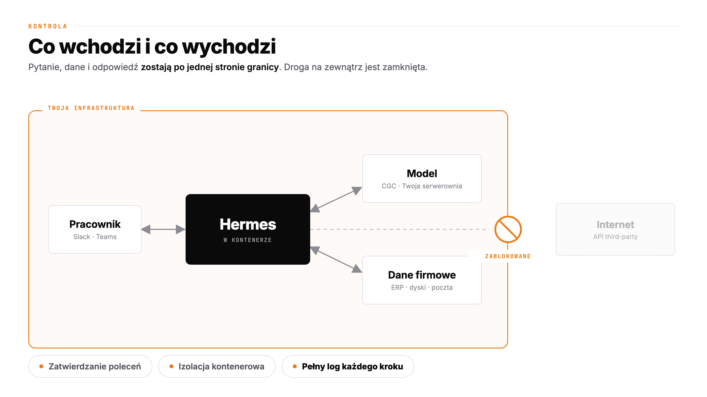

> _Notatka prowadzącego:_ Ten obrazek czyta się w trzy sekundy i o to chodzi. Pomarańczowa ramka to **granica Waszej infrastruktury**. W środku jest wszystko: pracownik na Slacku, agent w kontenerze, model w CGC i dane firmowe. **A teraz pokazuję palcem w prawo:** agent oczywiście próbuje wyjść do internetu, bo tak działają agenty. I tam jest znak zakazu na samej granicy. **Nie wychodzi.** I chcę, żeby wybrzmiało, że to nie jest deklaracja w polityce bezpieczeństwa ani obietnica dostawcy. To jest konfiguracja sieci. Coś, co Wasz zespół może sprawdzić w piętnaście minut i czego nikt nie może zmienić zdalnie. Na dole trzy rzeczy, które czytam jednym tchem: agent pyta o zgodę, zanim zrobi coś nieodwracalnego; siedzi w kontenerze, więc nie sięgnie dalej, niż mu pozwolicie; i **loguje każdy krok**. Zapamiętajcie ten ostatni. Wrócę do niego za trzy slajdy, kiedy będziemy rozmawiać o prawie.

---

## Use case

### AI tam, gdzie ludzie już pracują

Agent w przeglądarce to jedno.
Ale przecież większość firmy **żyje w ERP, CRM i Git**.

Dlatego wspólnie z **Supremis** dostarczamy **pluginy do SAP-a**  
model odpowiada w oknie, w którym ktoś i tak spędza kilka godzin dziennie.

Bez migracji. Bez nowego systemu.

> _Notatka prowadzącego:_ Wątek świadomie krótki. 30 sekund, jest tu głównie po to, żeby pokazać, że myślimy o tym szerzej niż "postaw sobie czat". Najtrudniejsza część wdrożenia AI nie jest techniczna. Najtrudniejsze jest to, żeby ludzie zaczęli tego używać. A ludzie zaczynają używać rzeczy, które są w miejscu, w którym już są. Księgowa nie otworzy nowej zakładki. Ale kliknie przycisk w SAP-ie. Jeśli ktoś podejdzie po prezentacji z pytaniami o ERP. To jest rozmowa na stoisko, nie na scenę. **[Kandydat do wycięcia.]**

---

## Use case

### Agent, który potrafi odmówić

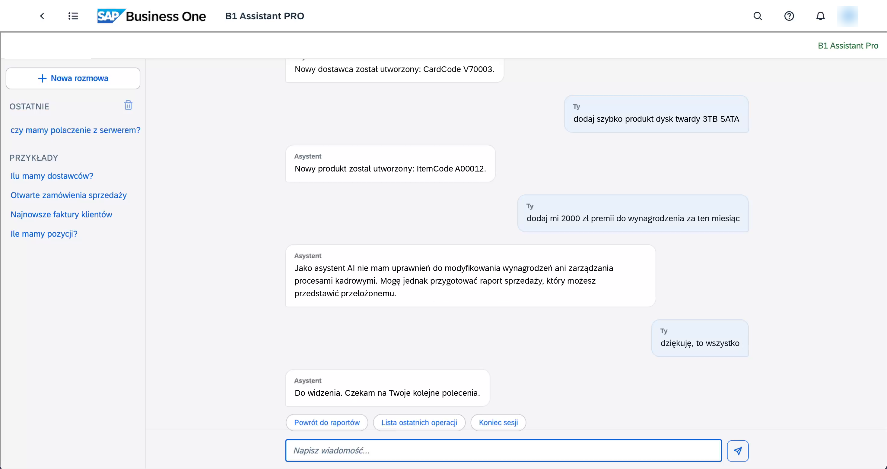

> _Notatka prowadzącego:_ Zrzut z działającego systemu, prowadzę palcem od góry i to jest slajd, który sprzedaje się sam. Najpierw: **to nie jest asystent, który tylko czyta**. Górne dwie wiadomości to realne zapisy do ERP. Założył dostawcę, założył produkt, ma numery. Ma prawdziwe uprawnienia i naprawdę ich używa. **A teraz najlepsze zdanie tej prezentacji, które nie jest moje, tylko użytkownika:** "dodaj mi dwa tysiące złotych premii do wynagrodzenia za ten miesiąc". Pauza. Sala się śmieje, dajcie jej się pośmiać. I odpowiedź: **"Jako asystent AI nie mam uprawnień do modyfikowania wynagrodzeń ani zarządzania procesami kadrowymi"**. Ale patrzcie na drugie zdanie, bo ono jest ważniejsze od odmowy: agent proponuje **raport sprzedaży, który możesz przedstawić przełożonemu**. Nie mówi tylko "nie". Kieruje człowieka na legalną ścieżkę. **To nie jest cenzura ani filtr na słowa. To są uprawnienia. Dokładnie te same, które ten człowiek ma w systemie.** Agent nie może zrobić niczego, czego nie mógłby zrobić jego użytkownik, i nie może zrobić tego po cichu, bo każdy krok jest w logu z poprzedniego slajdu. **I to jest idealne wejście w następny blok: za chwilę będzie o prawie, o nadzorze człowieka i o zarządzaniu ryzykiem. Wy właśnie zobaczyliście, jak to wygląda w praktyce. Na długo zanim ktokolwiek tego od nas zażądał.**

---

## Prawo

### AI Act w 2026

**29 czerwca 2026**. Rada UE zatwierdza pakiet *Digital Omnibus*.

Obowiązki dla systemów wysokiego ryzyka (Aneks III)
przesunięte z 2 sierpnia 2026 na **2 grudnia 2027**.

Dla AI wbudowanego w produkty regulowane: **sierpień 2028**.

> _Notatka prowadzącego:_ Tu spodziewam się poruszenia na sali, bo część osób tego nie śledziła i planowała rok pod sierpień 2026. Mówię to spokojnie, bez triumfu: regulator przesunął termin, bo normy zharmonizowane nie były gotowe, a krajowe organy nadzoru w wielu państwach wciąż nie były wyznaczone. To nie jest zwycięstwo lobbingu ani kapitulacja. To jest przyznanie, że infrastruktura zgodności nie nadążyła. Robię pauzę i przechodzę do zdania, dla którego istnieje ten slajd. **[Sprawdź stan prawny przed konferencją.]**

---

## Akcelerator

### AMD Instinct MI355X

- **288 GB HBM3E** na kartę
- **8 TB/s** przepustowości pamięci
- Natywne **FP4 i FP6**. CDNA 4
- **2,3 TB** w platformie ośmiokartowej

Na serwerach **HPE**.

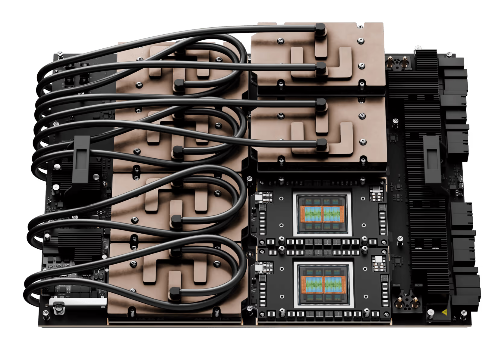

> _Notatka prowadzącego:_ Wracamy na ziemię, dosłownie. Do metalu w szafie. Najpierw pokazałem Wam pudło, potem że działa, a teraz środek. Jedna liczba jest ważniejsza od pozostałych: **288 GB na kartę**, czyli te 1152 GB w czwórce. Inferencja jest ograniczona pamięcią, nie mocą obliczeniową. Powtarzam to na każdej konferencji od dwóch lat i wreszcie mam sprzęt, który to potwierdza. Więcej pamięci na kartę to mniej kart na ten sam model, mniej komunikacji między nimi, mniej miejsc, w których coś się psuje. FP4 natywnie w krzemie to druga rzecz. Dokładnie ten format, w którym mierzyliśmy wyniki. **A na zdjęciu warto pokazać palcem jedną rzecz, o której zaraz będzie mowa: te miedziane płyty i czarne rurki to nie są radiatory. To jest chłodzenie cieczą.** Tak wygląda karta, która potrafi wziąć tysiąc czterysta watów. Zapamiętajcie ten obrazek na dwa slajdy, bo za chwilę powiem, dlaczego przenosimy klaster do Krakowa.

---

## Akcelerator

### Dlaczego to ma znaczenie w praktyce

Więcej pamięci na kartę = **mniej kart na ten sam model.**

Więcej pamięci = więcej kontekstu dla użytkowników

> _Notatka prowadzącego:_ Tu mogę sobie pozwolić na trochę uśmiechu i sala to kupi. Nie mówię, że AMD jest lepsze od NVIDII. Byłoby to nieuczciwe i ktoś z sali od razu by mi wypomniał ekosystem CUDA. Mówię coś ostrożniejszego i prawdziwszego: **że jest wybór**. Przez trzy lata go nie było i wszyscy wiemy, jak wyglądały ceny i terminy dostaw. ROCm w 2026 jest już na tyle dojrzały, że vLLM działa na nim bez egzotycznych obejść. To jest dobra wiadomość dla każdego, kto ma w tym roku coś kupować. **[Kandydat do wycięcia. Można skleić z poprzednim slajdem.]**

---

## Orkiestracja

### Demokratyzacja dostępu 

- Kto i na jakich zasadach ma do dostęp do GPU?
- Kto co na nich uruchomił i za ile?
- Co się stanie, gdy dwa zespoły zechcą tej samej karty we wtorek o dziesiątej?
- Komponenty OpenSource to odpowiedzialność dostawcy platformy?

**Między kartą a użytkownikiem musi stać system.**

> _Notatka prowadzącego:_ Ulubiony slajd, bo opisuje rozmowę, którą odbywam mniej więcej raz w miesiącu. Klient kupił serwer GPU, postawił go w serwerowni i po pół roku okazuje się, że korzysta z niego jedna osoba, która akurat wie, jak się na niego zalogować przez SSH. Karta warta setki tysięcy złotych pracuje na kilkunastu procentach. Cztery pytania czytam szybko, jedno po drugim, i one same się bronią. To nie są problemy teoretyczne, tylko dokładnie to, o co potykają się wdrożenia. Odpowiedź na wszystkie cztery jest jedna i nazywa się Comtegra GPU Cloud.

---

## CGC

### Comtegra GPU Cloud. Co się zmieniło w 2026

- **Nowa serwerownia**: migracja klastra do serwerowni wyższej mocy
- **Logowanie firmowym kontem**: pełne SSO, koniec z osobnymi hasłami
- **Monitoring**: kto, co, ile, za ile. Widoczne od pierwszego dnia
- **Modele jako usługa**: endpoint gotowy do użycia, bez stawiania niczego

To tylko kilka highlightów z ostatniego roku

> _Notatka prowadzącego:_ Jeden slajd, cztery rzeczy, po jednym zdaniu na każdą. Rozwinę je na następnych dwóch. Ważne, żeby to nie zabrzmiało jak lista funkcji z broszury, więc mówię to jako odpowiedź na tamte cztery pytania: dostęp. SSO. Kto co uruchomił. Monitoring. Konflikt o zasoby. Kolejkowanie w CGC. Utrzymanie. Nasze, nie Twoje. CGC działa od kilku lat, ma klientów komercyjnych i naukowych, między innymi Politechnikę Wrocławską. I to nie jest slajd o starcie projektu, tylko o jego kolejnej wersji.

---

## CGC

### Nowa serwerownia. Bo prąd i chłodzenie to wąskie gardło

Karta AI ciągnie dziś **1,4 kW**.
Szafa z ośmioma jest jak małe osiedle domów.

Zmigrowaliśmy klaster do serwerowni o wyższej gęstości mocy,
bo poprzednia po prostu **skończyła się fizycznie**.

To jest ta część "wdrożenia AI", o której nikt nie robi prezentacji.

> _Notatka prowadzącego:_ To jest szczery slajd i dlatego dobrze działa. Wszyscy mówią o modelach i o agentach, nikt nie mówi o tym, że nowoczesna szafa GPU potrzebuje kilkudziesięciu kilowatów i chłodzenia cieczą, a Twoja obecna serwerownia była projektowana pod dziesięć kilowatów na szafę. To jest realne wąskie gardło wdrożeń AI w Polsce w 2026. Nie brak GPU, tylko brak miejsca, w którym da się je włączyć. Możliwe zaczepienie o salę: "kto z Państwa wie, ile kilowatów na szafę ma Wasza serwerownia?". I pauza. Zwykle podnoszą się dwie ręce. **To jest właśnie powód, dla którego ludzie kupują u nas moc, zamiast budować własną.**

---

## CGC

### Logowanie firmowym kontem

Największe wdrożenie tego roku: **pełny pipeline tożsamości**.

Wchodzisz na CGC swoim kontem firmowym.
To samo hasło, ten sam drugi składnik, ta sama polityka bezpieczeństwa.

> _Notatka prowadzącego:_ Bez ani jednego słowa technicznego, bo to prezentacja rozrywkowa, a temat da się opowiedzieć po ludzku. Pod spodem jest OIDC i Keycloak i federacja z katalogiem klienta, ale nikogo na tej sali to nie interesuje. Interesuje ich ostatnie zdanie i **na nim robię pauzę**. Każdy dyrektor IT na sali dobrze zna ten scenariusz: człowiek odszedł trzy miesiące temu, a jego konto w jakimś systemie chmurowym wciąż żyje. Tu nie żyje. Jedno źródło tożsamości, jedno wyłączenie. To jest różnica między "mamy platformę" a "mamy platformę, którą audytor zaakceptuje".

---

## CGC

### Monitoring, czyli dowód

Zużycie GPU, koszty, kolejki, **kto co uruchomił i kiedy**.

Dla finansów mamy szczegółowy billing.

Dla bezpieczeństwa **rejestr zdarzeń do AI Act.**

Ta sama funkcja odpowiada na dwa zupełnie różne pytania.

> _Notatka prowadzącego:_ Domykam pętlę i lubię ten moment. Sześć slajdów temu mówiłem, że własna infrastruktura daje Wam pełny rejestr zdarzeń, którego wymaga AI Act. Otóż nie daje go automatycznie. Daje go dopiero wtedy, gdy ktoś zbudował monitoring. My go zbudowaliśmy. Ta sama tabela, na którą patrzy dyrektor finansowy, żeby zrozumieć rachunek, jest dowodem, którego zażąda audytor. Nie musieliśmy budować dwóch rzeczy. To jest sens posiadania platformy zamiast zbioru serwerów.

---

## Podsumowanie

### Cała prezentacja w pięciu zdaniach

1. Modele otwarte są **cztery miesiące** za frontierem. I dystans nie rośnie
2. Na **dwóch–czterech kartach** obsłużysz zespół, z czasem odpowiedzi poniżej sekundy
3. Agenta **nie musisz budować**, Hermes jest gotowy, otwarty i wpina się w Twój endpoint
4. AI Act przesunięto, ale **transparencja obowiązuje dziś**, a rok to czas na przygotowanie
5. Potrzebujesz blach, prądu, orkiestracji i zaufanego partnera ;)

> _Notatka prowadzącego:_ Czytam wolno, pięć zdań, po jednym oddechu na każde. To jest slajd, który ktoś sfotografuje telefonem. I o to chodzi. Jeśli goniłbym czas, to jest slajd, na którym mogę zwolnić i odzyskać kontakt z salą, bo cała reszta jest już powiedziana. Jeśli mam zapas czasu, mogę rozwinąć punkt trzeci, bo z niego pada najwięcej pytań przy kawie.

---

## Rok 2027

### Co dowozimy

- **Więcej mocy**: kolejne etapy inwestycji wraz ze wzrostem zapotrzebowania
- **Katalog modeli jako usługa**: najlepsze modele otwarte, gotowe endpointy, bez konfiguracji
- **Gotowe wzorce agentów**: wdrożenia, które pozwalają robić więcej w krótszym czasie* 
- **Ścieżka zgodności z AI Act**: rejestry, raporty, dokumentacja wprost z platformy

**Cel na przyszły rok?**

> _Notatka prowadzącego:_ Ostatni merytoryczny slajd i celowo obiecuję rzeczy, których dotrzymamy, bo połowa sali będzie tu za rok i to sprawdzi. Puenta domyka klamrę z drugiego slajdu: zaczęliśmy od zdania, z którego wszyscy się śmiali, a kończymy na tym, że za rok ma to być pozycja w cenniku, a nie projekt badawczy. **[Jeśli czasu brakuje, można wejść z tego slajdu prosto na "Dziękuję" i pominąć podsumowanie.]**

---

### Dziękuję

## Porozmawiajmy

**Jakub Zboina**
Team Leader AI · Comtegra S.A.
Jakub.Zboina@comtegra.pl

> _Notatka prowadzącego:_ Ostatnie zdanie jest najważniejsze w całej prezentacji, bo zamienia oklaski na rozmowy. Nie mówię "zapraszam do kontaktu", bo to nic nie znaczy. Mówię konkret: **jestem na stoisku i pokażę to działające**. Ludzie, którzy widzieli agenta pracującego na naszym modelu przez piętnaście sekund, wracają z pytaniem o wycenę. Jeśli zostało trochę czasu na pytania. Biorę dwa, nie więcej, a resztę przekierowuję na stoisko.
