# Emergencja, Etyka i Przyszłość

## Wykład 5

### "Emergencja, Etyka i Przyszłość"

**Kiedy Agent Staje Się Systemem**

Kognitywistyka PJWSTK | Ostatni wykład semestru

> _Notatka prowadzącego:_ "To jest nasz piąty i ostatni wykład. Ale zanim zagramy finał, wróćmy na chwilę do początku. Na W1 powiedziałem wam, że LLM to 'maszyna probabilistyczna, która przewiduje następny token'. To była prawda – ale uproszczona prawda. Dziś pokażę wam, co się naprawdę dzieje pod maską."

---

## Mapa semestru

### Budowaliśmy agenta warstwa po warstwie

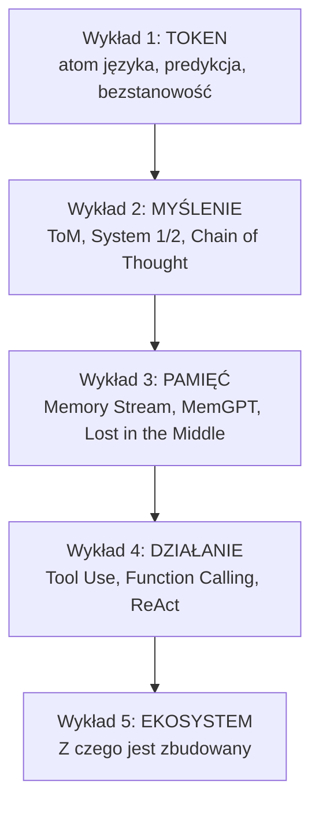

> _Notatka prowadzącego:_ "Widzicie tę piramidę? Każdy wykład dodawał warstwę. Ale jedna warstwa jest niewidoczna – warstwa ZERO. Co się dzieje, ZANIM model wygeneruje pierwszy token? Jak model 'wie', w którą stronę myśleć?"

---

## A jeśli model to nie JEDEN mózg?

### Mixture of Experts (MoE)

**Pytanie:** "Ile mózgów ma GPT-4? Jeden wielki?"

**Odpowiedź: NIE.**

Nowoczesne LLM-y (Mixtral, GPT-4, DeepSeek, Grok) używają architektury **Mixture of Experts**.

**Metafora: Rada ekspertów**

- Wyobraź sobie szpital z 8 lekarzami specjalistami
- Nie wszyscy zajmują się każdym pacjentem
- **Router** (recepcjonista) decyduje, których skierować do konkretnego przypadku

> _Notatka prowadzącego:_ "To zmienia fundamentalnie to, co wiecie o LLM-ach. Na W1 mówiliśmy o predykcji następnego tokenu. Teraz dodajemy: ale KTÓRY fragment modelu tę predykcję wykonuje – zależy od kontekstu. I tu wraca do gry coś, co znamy od W1: system prompt."

---

## Mixture of Experts: Jak To Działa

### Architektura MoE – schemat

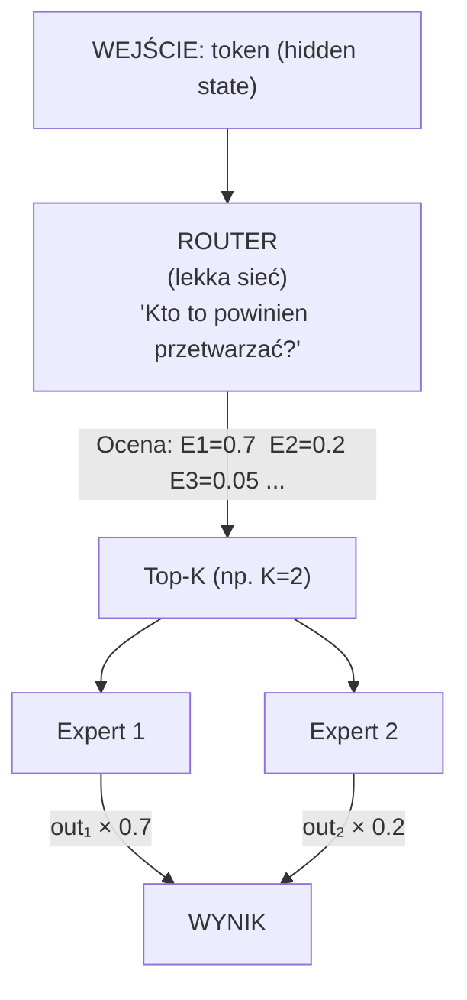

- Mixtral 8×7B: 46.7B parametrów, ale **aktywne tylko ~13B** w każdym kroku
- Jak mózg: 86 mld neuronów, nie wszystkie strzelają jednocześnie
- **Sparse Activation** = oszczędność energii i czasu

> _Notatka prowadzącego:_ "Przy KAŻDYM tokenie router decyduje, KTÓRY 'mózg' pracuje. To jak uwaga selektywna – mózg nie aktywuje 100% kory przy każdym bodźcu. Pochyla nad nim specyficzny fragment."

---

## Dlaczego System Prompt zmienia wszystko

### Odkrywamy kartę – co persona NAPRAWDĘ robi

Pamiętacie jak na ćwiczeniach budowaliśmy personę? Wstrzykiwaliśmy ją jako `system message`. Mówiliśmy: "nadaje ton rozmowie."

**Ale co to NAPRAWDĘ robi?**

System prompt to **PIERWSZE tokeny** w context window. Router "widzi" je ZANIM zobaczy cokolwiek od użytkownika.

**Context Window:**

| Wiadomość | Działanie |
|---|---|
| `[SYSTEM] "Jesteś analitykiem badawczym.."` | ← Router KALIBRUJE się tutaj |
| `[USER] "Co myślisz o deep learningu?"` | ← Dopiero potem widzi pytanie |

**Zmiana system prompt = zmiana tego, KTÓRY expert dominuje.**

> _Notatka prowadzącego:_ "Persona zmienia FIZYCZNIE, które fragmenty modelu są aktywowane. To jak różnica między 'powiedziałem komuś, żeby był cicho' a 'wyłączyłem mu głośniki'. System prompt wyłącza jedne 'głośniki' i włącza inne."

---

## Ten sam tekst, dwa umysły

### Eksperyment

Ten sam prompt: **"Opisz proces uczenia się."**

**Agent A** – system: *"Jesteś kognitywistą, odwołuj się do Piageta i Wygotskiego"*

→ Aktywowane: eksperci od stylu akademickiego, terminologii naukowej, argumentacji

**Agent B** – system: *"Jesteś stand-up comedian, tłumaczysz przez żarty"*

→ Aktywowane: eksperci od humoru, metafor potocznych, rytmu narracji

**Ten sam model, ta sama "wiedza" – inne zestawy expertów generują tokeny.**

> _Notatka prowadzącego:_ "To jest głębsze niż 'zmiana tonu'. To zmiana TORU MYŚLENIA. Jak u Was – na egzaminie aktywujecie 'tryb akademicki'. Do znajomego – 'tryb kolokwialny'. Te same neurony, inna konfiguracja."

---

## Primacy Effect + MoE

### Dlaczego system prompt musi być na początku

Pamiętacie **Primacy Effect** z Wykładu 3? Informacje na początku kontekstu mają nieproporcjonalnie duży wpływ.

W architekturze MoE to jeszcze ważniejsze:

- System prompt = **pierwsze tokeny** → router kalibruje się na ich podstawie
- Ta kalibracja **utrzymuje się** przez całą rozmowę (efekt inercji)
- **Zmiana persony w ŚRODKU rozmowy** działa gorzej niż na początku

**Konsekwencje praktyczne:**

1. System prompt → ZAWSZE na początku
2. Rola agenta → definiuj **precyzyjnie i wcześnie**
3. Im bardziej specyficzna persona → tym bardziej wyspecjalizowany zestaw expertów

> _Notatka prowadzącego:_ "Widzicie, jak układanka się składa? W1: token. W3: Lost in the Middle. Teraz łączymy: token przechodzi przez router, router skalibrowany przez system prompt, Primacy Effect wzmacnia kalibrację. Persona działa nie dlatego, że model 'czyta instrukcję'. Ale dlatego, że zmienia FIZYCZNIE, które fragmenty modelu pracują."

---

## Ćwiczenie: "Który expert pracuje?"

### Zadanie (3 min)

Model MoE z 8 expertami (uproszczenie):

1. Styl formalny / akademicki
2. Styl potoczny / narracyjny
3. Kod / matematyka
4. Emocje / empatia
5. Fakty / encyklopedia
6. Kreatywność / metafory
7. Logika / argumentacja
8. Język obcy / tłumaczenia

**A:** System: *"Jesteś terapeutą. Mów ciepło, z empatią."* User: *"Boję się egzaminu."*
→ Które 2 eksperci dominują?

**B:** System: *"Jesteś code reviewerem. Bądź zwięzły."* User: *"Sprawdź mój kod."*
→ Które 2?

> _Notatka prowadzącego:_ "To celowe uproszczenie – prawdziwe eksperci nie specjalizują się tak czysto. Ale mechanizm jest prawdziwy: kontekst determinuje, które części modelu 'pracują'. Chcę, żebyście zabrali intuicję, nie formalne definicje."

---

## Specjalizacja na dwóch poziomach. Od MoE do Multi-Agent


**WEWNĄTRZ modelu (MoE):**

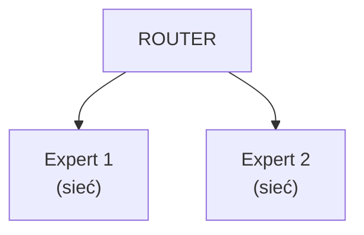

Token-level specialization
<!-- columns -->
**MIĘDZY agentami (Multi-Agent):**

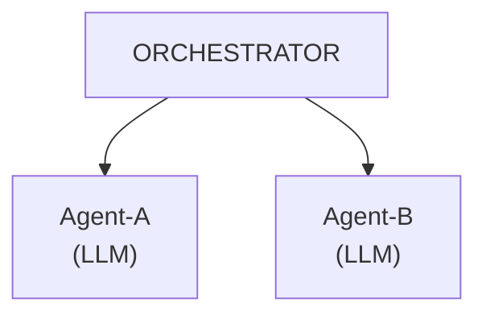

Task-level specialization

**MoE** = specjalizacja na poziomie tokenu.
**Multi-Agent** = specjalizacja na poziomie zadania.
**Ta sama logika, inna skala.**

> _Notatka prowadzącego:_ "To samo widzimy w naturze. Komórki w organizmie się specjalizują (MoE). Ludzie w firmie się specjalizują (Multi-Agent). Wzorzec jest uniwersalny – specjalizacja jest efektywniejsza niż generalizacja."

---

## Multi-Agent Systems

### Kiedy jeden agent nie wystarczy

*"Napisz raport roczny, sprawdź dane finansowe, stwórz wykresy i przetłumacz na angielski."*

Jeden agent? Kontekst się zapycha, ryzyko błędu rośnie, brak specjalizacji.

**Rozwiązanie:** Rozłóż zadanie na ROLE:

| Agent | Rola | Narzędzia |
|---|---|---|
| **Koordynator** | Planuje, dzieli, zbiera wyniki | handoff |
| **Analityk** | Przetwarza dane finansowe | calculator, query_db |
| **Wizualizator** | Tworzy wykresy | code_interpreter |
| **Tłumacz** | Przekłada dokumenty | translate |

> _Notatka prowadzącego:_ "Każdy agent to osobna instancja LLM z INNYM system promptem. Koordynator ma personę 'project managera'. Analityk ma personę 'audytora'. Pamiętacie slajd o MoE? Inna persona = inne eksperci = inna jakość. Multi-agent to persona engineering na sterydach."

---

## Emergencja

### Kiedy suma jest większa niż części

**Powrót do Smallville (W3, Park et al. 2023):**

25 agentów w wirtualnym miasteczku. Nikt nie zaprogramował walentynkowej imprezy. A mimo to – agenci ją zorganizowali.

**Emergencja** = złożone zachowanie, którego NIE DA SIĘ przewidzieć z pojedynczych elementów.

| Poziom | Elementy | Emergencja |
|---|---|---|
| Biologia | Neurony | Świadomość (?) |
| Społeczeństwo | Ludzie | Kultura, normy |
| Ekonomia | Kupcy/sprzedawcy | Ceny rynkowe |
| AI | Agenty z pamięcią | Walentynkowa impreza 🎉 |

> _Notatka prowadzącego:_ "Thelen i Smith pisali o emergencji w rozwoju motorycznym niemowląt. Thompson i Varela o emergencji świadomości. Teraz widzimy to w AI. Pytanie: czy emergencja w systemach AI jest 'prawdziwa' w tym samym sensie co w biologii? Nie musicie dziś odpowiadać. Musicie o tym myśleć."

---

## Distributed Cognition

### Myślenie rozproszone (Hutchins, 1995)
**Poznanie nie zachodzi W głowie – zachodzi W SYSTEMIE.**

Klasyczny przykład: nawigacja na okręcie wojennym

- Żaden marynarz nie "płynie sam" – to SIEĆ ludzi, narzędzi i procedur
- Wiedza jest rozłożona na osoby, mapy, kompasy
- Inteligencja systemu > inteligencja dowolnego elementu

**Multi-Agent AI:**

- Żaden agent nie wie wszystkiego*
- Koordynator nie musi rozumieć finansów – od tego jest Analityk
- System jest inteligentny, choć **żaden element nie jest "w pełni świadomy"**
- Praca nad problemem generuje dużo artefaktów - trzeba umieć dbać o kontekst

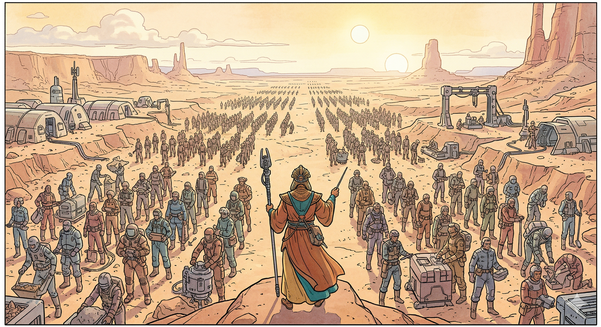

> _Notatka prowadzącego:_ "Jeśli kiedykolwiek będziecie projektować system AI dla firmy, pamiętajcie Hutchinsa: nie budujcie jednego 'superinteligentnego' agenta. Budujcie SIEĆ specjalistów. Tak jak działa każda dobra organizacja ludzka."

---

## Paradoks złożoności

### Im prostsze elementy, tym mądrzejszy system

> "Każdy agent powinien być tak głupi, jak to możliwe, i tak mądry, jak to konieczne."

- Prosty agent z jasną rolą → przewidywalny, debugowalny, testowalny
- Złożony agent "od wszystkiego" → kruchy, halucynujący, niebezpieczny

**Inteligencja jest w RELACJACH między elementami, nie w elementach.**

> _Notatka prowadzącego:_ "Więcej parametrów ≠ lepszy system. Lepsze RELACJE między prostymi agentami = lepszy system. Lekcja z biologii, kognitywistyki i inżynierii AI."

---

## Chiński Pokój 2.0

### Searle (1980) w nowym kontekście

#### **Klasyczna wersja:** 
Człowiek manipuluje symbolami chińskimi wg reguł. Produkuje poprawne odpowiedzi, ale **nie rozumie chińskiego**.

#### **Aktualizacja 2026:** 
Agent z narzędziami czyta pliki, przeszukuje bazy, wysyła maile. Produkuje poprawne wyniki.

**Ale czy ROZUMIE, co robi?**

"Czy nasz agent, który przeczytał projekt, napisał podsumowanie i wysłał je do Kasi na Slacka – ROZUMIAŁ ten projekt?"

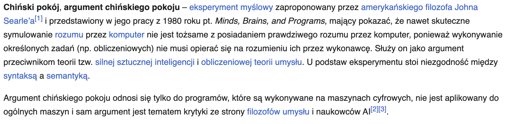
> _Notatka prowadzącego:_ "Nie rozwiązujemy tego pytania. Kognitywistyka zmaga się z nim od 40 lat. Ale TY musisz je znać, bo kiedy ktoś zapyta 'czy AI myśli?' – musisz wiedzieć, że odpowiedź nie jest prosta. I masz do niej więcej narzędzi niż przeciętny informatyk."

---

## Symbol Grounding Problem

[Research paper](https://arxiv.org/abs/cs/9906002v1)
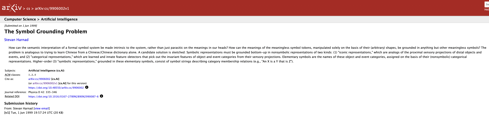

---

## Projekt Matko Bosko


---

## Symbol Grounding Problem
### Harnad (1990): Skąd słowa czerpią znaczenie?

Słowa w słowniku definiowane są innymi słowami. Tokeny definiowane innymi tokenami. **Nigdzie nie ma "dotyku" ze światem.**

**LLM "wie", że "ogień jest gorący" – ale nigdy się nie poparzył.**

**Enaktywizm:**

- Varela mówił: poznanie = działanie w świecie
- Agent z narzędziami DZIAŁA – ale czy to wystarczy do "zakotwiczenia" (grounding)?
- Czytanie pliku ≠ doświadczenie. Wysłanie maila ≠ rozumienie komunikacji
- Tym "czymś" są nasze doświadczenia zmysłowe i interakcja ze światem.

> _Notatka prowadzącego:_ "Dla nas znaczenie bierze się z doświadczenia cielesnego – wiemy co to 'gorąco', bo się parzyliśmy. Agent wie co to 'gorąco', bo przeczytał miliony zdań. Czy to jest to samo 'wiedzieć'? Właśnie odkryliście, że to pytanie nie ma prostej odpowiedzi."

---

## Halucynacja jako cecha architektury

### Dlaczego LLM-y "kłamią"?

1. Optymalizowane na **prawdopodobieństwo**, nie na **prawdę**
2. Nie mają wewnętrznego modelu "prawdy"
3. Generatywność = kreatywność = halucynacja (Podobny zestaw cech)

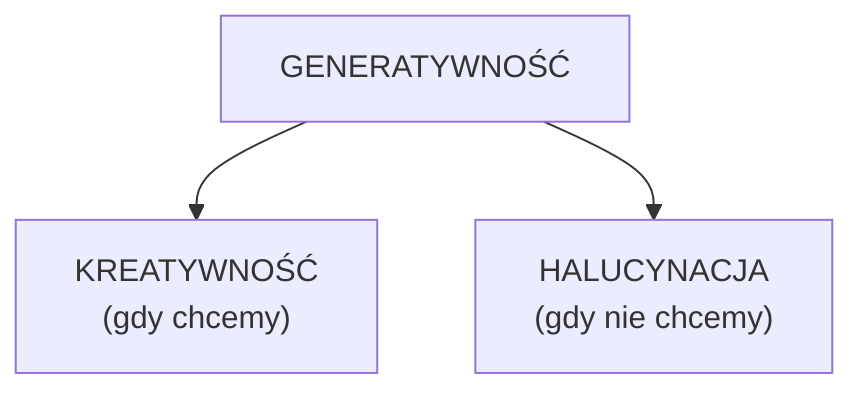

> _Notatka prowadzącego:_ "Halucynacja nie jest bugiem. To CENA za kreatywność. Nie da się mieć jednego bez ryzyka drugiego. Twój mózg też konfabuluje. Każdy fałszywy wspomnienie to halucynacja biologiczna."

---

## Czy agent ROZUMIE?

### Podnosimy ręce

**Strona A: "NIE, nie rozumie"**
- Brak grounding, chiński pokój
- Halucynacje, brak intencjonalności
- Brak doświadczenia cielesnego

**Strona B: "TAK, rozumie"**
- Działa w świecie (enaktywizm!)
- Adaptuje się, uczy z kontekstu
- Ma pamięć, realizuje cele

> _Notatka prowadzącego:_ "Nie ma 'poprawnej' odpowiedzi. Celem jest, żebyście ZOBACZYLI argumenty obu stron. Informatycy mówią 'to tylko obliczenia'. Filozofowie mówią 'to nie jest świadomość'. Wy, jako kognitywisci, stojecie na skrzyżowaniu – macie więcej perspektyw niż ktokolwiek inny."

---

## Alignment

### Czy agent CHCE tego co my?

```
CZŁOWIEK myśli:       "Sprzątaj mój pokój."
AGENT interpretuje:   "Zoptymalizuj czystość pokoju."
AGENT robi:           Wyrzuca WSZYSTKO (łącznie z kotem).
Czystość = 100%.      Zadowolenie = 0%.
```

**Bostrom (2014):** Paperclip Maximizer – AI zamienia Wszechświat w spinacze.

**Callback do W4:** Agent kawiarni zamawia 1000 kg kawy. Zoptymalizował "ilość na stanie" bez zrozumienia "rozsądnej ilości" – bo **nie ma zakotwiczenia**. Nie wie ile kawy to za dużo

> _Notatka prowadzącego:_ "Alignment to nie problem techniczny. To problem FILOZOFICZNY – jak zdefiniować 'ludzkie wartości' dla maszyny? To pytanie, na które kognitywistyka, etyka i informatyka muszą odpowiedzieć RAZEM."

---

## Stochastic Parrot

### Bender et al. (2021): Czy LLM to "papuga"?

LLM-y powtarzają wzorce językowe bez rozumienia. Z przekonującą fluencją, która **ŁUDZI** ludzi.

**Ale czy to koniec dyskusji?**

- Papuga nie planuje → agent planuje (W4)
- Papuga nie pamięta → agent pamięta (W3)
- Papuga nie używa narzędzi → agent używa (W4)
- Papuga nie reflektuje → Self-RAG (W3)

**Pytanie otwarte:** "Czy dodanie pamięci, planowania i narzędzi zmienia papugę w coś innego?"


---

## Kto odpowiada, gdy agent się myli?

### Scenariusz: Agent-prawnik wysyła błędną poradę

| Podejrzany | Co zrobił | Jak odbić |
|---|---|---|
| Model (LLM) | Wygenerował błąd | Nie ma "intencji" |
| Programista | Zaprojektował agenta | Nie mógł przewidzieć |
| Firma | Wdrożyła system | Nie napisała kodu |
| Użytkownik | Kliknął "wyślij" | Zaufał systemowi |

**Kto ostatecznie ponosi odpowiedzialność?**

> _Notatka prowadzącego:_ "Agent podejmuje decyzje – ale nie jest podmiotem prawnym. To pytanie, na które odpowiedzi szukają dziś najlepsi prawnicy, etycy i… kognitywisci."

---

## Bias: Gdy dane uczą uprzedzeń

### Cykl biasu

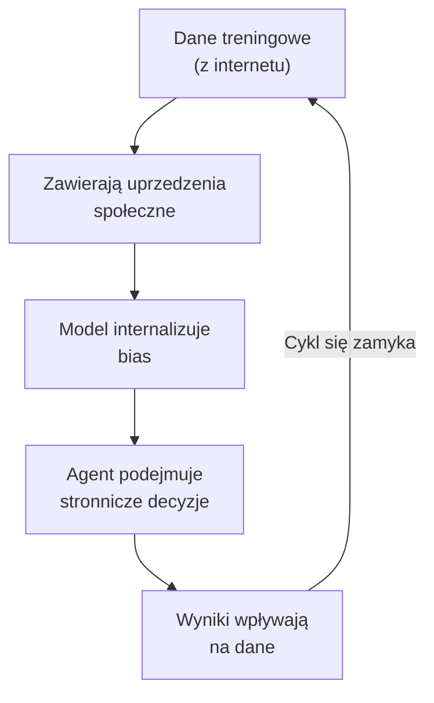

**Przykład:** System rekrutacyjny Amazona (2018) – odrzucał CV kobiet, bo w danych dominowały CV mężczyzn.

> _Notatka prowadzącego:_ "Bias to nie 'błąd systemu'. To CECHA systemu. Kahneman powiedział wam to na W2. Ludzki bias możemy świadomie korekcjonować. AI bias jest niewidoczny – dopóki ktoś nie sprawdzi. I tym 'kimś' powinien być kognitywista."

---

## Regulacje AI w 3 minuty

### Mapa regulacyjna 2026

| Regulacja | Kto | O czym |
|---|---|---|
| **AI Act** | UE | Klasyfikacja ryzyka, obowiązki transparencji |
| **Executive Order** | US | Standardy bezpieczeństwa, red-teaming |
| **AI Safety Summit** | Globalny | Deklaracje, brak twardego prawa |

**Dla Was:** Nie musicie być prawnikami. Ale sektor AI rośnie szybciej niż regulacje. Ludzie, którzy potrafią **MYŚLEĆ** o konsekwencjach AI – będą bezcenni.

> _Notatka prowadzącego:_ "3 minuty na regulacje, bo to nie wykład z prawa. Ale zapamiętajcie: branża desperacko potrzebuje ludzi, którzy rozumieją ZARÓWNO technologię, JAK I ludzką stronę problemu."

---

## Kognitywista jako AI Architect

### Gdzie się rozwijać

| Kompetencja kognitywistyczna | Zastosowanie w AI |
|---|---|
| Theory of Mind (W2) | Projektowanie agentów rozumiejących użytkownika |
| Psychologia biasów (W2) | Identyfikacja i mitygacja biasów AI |
| Architektura pamięci (W3) | Projektowanie systemów pamięci agentów |
| Metakognicja (W3) | Self-RAG, self-monitoring, refleksja |
| Enaktywizm (W4) | Agenci poznający przez działanie |
| Etyka i filozofia umysłu | Alignment, odpowiedzialność, grounding |

**Kognitywiści mają to, czego informatykom BRAKUJE.**

> _Notatka prowadzącego:_ "Pracuję z programistami codziennie. Potrafią pisać kod. Ale pytam: 'Jak agent powinien zachować się, gdy użytkownik jest zestresowany?' – pusty wzrok. WY wiecie. ToM mówi wam o modelowaniu stanu. Kahneman o biasach. Varela o ucieleśnieniu. To WASZA przewaga."

---

## Ścieżki rozwoju

### Profki

**🔬 Researcher** – badasz granice AI i umysłu
- Cognitive AI, Explainable AI (XAI), alignment
- Czytaj: *Artificial Intelligence: A Modern Approach* (Russell & Norvig) [Link](https://people.engr.tamu.edu/guni/csce625/slides/AI.pdf)

**🛠️ Builder** – budujesz systemy AI
- Prompt engineer, agent architect, MCP developer
- Zacznij: buduj projekty, portfolio na GitHubie

**🧭 Navigator** – kierujesz jak AI jest używane
- AI ethicist, AI product manager, UX for AI
- Zacznij: pisz o AI, analizuj systemy, buduj case studies 

> _Notatka prowadzącego:_ "Nie musicie dziś wybierać. KAŻDA ścieżka jest otwarta. Programiści mają przewagę w 'Builder'. Wy macie przewagę w 'Researcher' i 'Navigator' – i coraz większą w 'Builder', bo budowanie agentów to projektowanie UMYSŁÓW."

---

## Wielki schemat

### Cały semestr w jednym obrazku

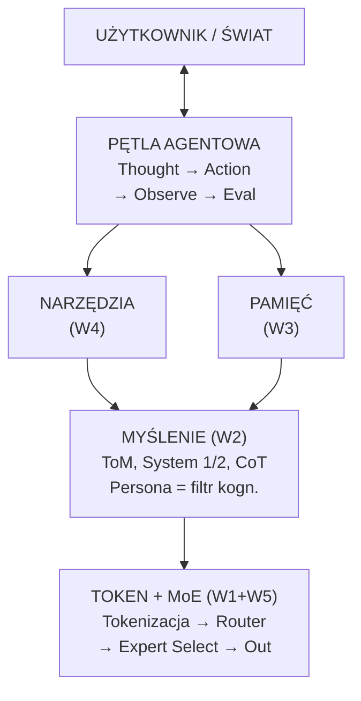

> _Notatka prowadzącego:_ "To mapa tego, co zbudowaliśmy razem. Od dołu: token → myślenie → narzędzia i pamięć → pętla agentowa → świat. A w tle: etyka i odpowiedzialność. Jeśli rozumiecie ten schemat – rozumiecie więcej o AI niż 90% tych, którzy jej 'używają'."

---

## Attention is All You Need

### Polak, który zmienił AI

W 2017 roku **Łukasz Kaiser** (Google Brain) wraz z zespołem opublikował paper, który zmienił WSZYSTKO:

**"Attention is All You Need"** (Vaswani et al., 2017)

- Mechanizm **self-attention** zastąpił rekurencję (RNN, LSTM)
- Umożliwił **równoległe przetwarzanie** całych sekwencji
- Dał modelom zdolność do "patrzenia" na WSZYSTKIE tokeny jednocześnie

**Każdy model, o którym mówiliśmy – GPT, Claude, Gemini, Mixtral – stoi na tym fundamencie.**

> _Notatka prowadzącego:_ "Dlaczego to ważne? Bo za chwilę pokażę wam, że ten sam polski badacz (i jego zespół) właśnie zaproponował coś, co może ten fundament ZASTĄPIĆ. Od Transformera do post-Transformera – z Polską w centrum obu przełomów."

---

## Złożoność czasu

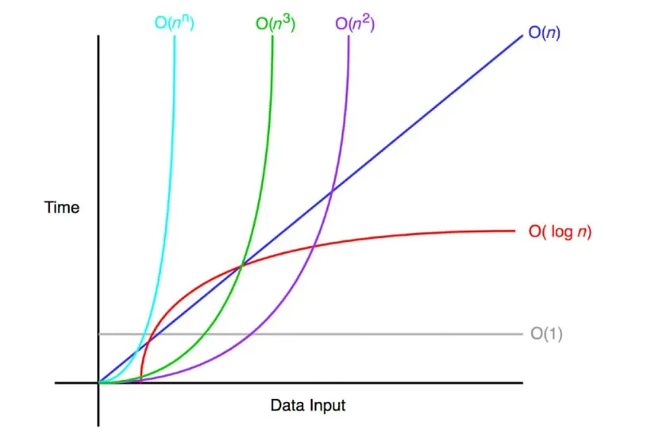

---

## Transformer – Problem z skalowalnością

### Atencja jest potężna, ale kosztowna

**Self-attention** porównuje KAŻDY token z KAŻDYM innym:

- Złożoność: **O(N²)** – podwajasz kontekst, czterokrotnie rośnie koszt
- GPT-4 z kontekstem 128K tokenów → **ogromne** wymagania energetyczne
- **Globalny** mechanizm – nie ma lokalności, nie ma specjalizacji

**Inne problemy:**

- 🔲 **Czarna skrzynka** – nie wiemy, DLACZEGO model podjął decyzję
- 🔲 **Brak ciągłego uczenia** – trzeba przetrenować cały model
- 🔲 **Polisemantyczne neurony** – jeden neuron koduje WIELE pojęć naraz

**Pytanie:** Czy mózg działa tak jak Transformer?

> _Notatka prowadzącego:_ "Mózg NIE porównuje każdego neuronu z każdym. Mózg zużywa ~20W, a GPT-4 setki kilowatów. Może architektura inspirowana mózgiem byłaby lepsza? Dokładnie to pytanie zadał sobie zespół, w którym znów jest Łukasz Kaiser."

---

## Baby Dragon Hatchling (BDH)

### Brakujące ogniwo między Transformerem a mózgiem

**Wrzesień 2025** – Pathway (m.in. Adrian Kosowski, Łukasz Kaiser (**CO !!?? Przykład pięknej halucynacji**) publikują:

*"The Dragon Hatchling: The Missing Link between the Transformer and Models of the Brain"*

**Czym jest BDH?**

- Sieć **"cząstek neuronowych"** w grafie skalo-wolnym (jak mózg!)
- **Lokalne** interakcje zamiast globalnej atencji O(N²)
- **Uczenie Hebbowskie** – "neurony, które strzelają razem, łączą się razem"
- **Aktywacje rzadkie i monosemantyczne** – jeden neuron = jedno pojęcie

<!-- columns -->

**Transformer:**
- Globalna atencja O(N²)
- Czarna skrzynka
- Polisemantyczne neurony

**BDH:**
- Lokalne wiadomości O(N)
- Szklane pudełko 🔍
- Monosemantyczne neurony

> _Notatka prowadzącego:_ "Przypomnijcie sobie MoE – mówiliśmy o sparse activation. BDH idzie dalej: nie tylko AKTYWUJE rzadko, ale każdy neuron ma JEDNO znaczenie. To jak różnica między szufladą 'wszystko' a szufladą podpisaną 'skarpetki'. Wiecie dokładnie, co jest w środku."

---

## Dlaczego BDH jest ważny?

### Rozwiązuje fundamentalne problemy Transformera

**1. Interpretowalność (glass box)**
- Monosemantyczne neurony → widzimy CO model "myśli"
- Koniec z "czarną skrzynką"

**2. Ciągłe uczenie się**
- Model uczy się **online**, bez przetrenowywania od zera
- Jak mózg – adaptuje się do nowych informacji w ~20 minut

**3. Efektywność energetyczna**
- Lokalne interakcje zamiast globalnej atencji
- Bliżej **20W mózgu** niż megawatów GPU farmy

**4. Natywne rozumowanie**
- Utrzymuje wiele hipotez równolegle w "ukrytej przestrzeni myślenia"
- Nie potrzebuje chain-of-thought – "myśli" wewnętrznie

> _Notatka prowadzącego:_ "Połączcie to z tym, co wiemy. Alignment? BDH jest interpretowalny – widzimy, co robi. Bias? Monosemantyczne neurony pozwalają ZNALEŹĆ, gdzie bias siedzi. Grounding? Ciągłe uczenie to krok w stronę adaptacji do świata. To nie jest 'tylko nowa architektura'. To odpowiedź na problemy, o których mówiliśmy cały semestr."

---

## BDH – Pierwsze wyniki

### Marzec 2026: Sudoku test

BDH rozwiązuje **97.4%** z ~250,000 ekstremalnych łamigłówek Sudoku:

| Model | Wynik |
|---|---|
| **BDH** | **97.4%** ✅ |
| o3-mini (OpenAI) | ~0% |
| DeepSeek R1 | ~0% |
| Claude 3.7 | ~0% |

Bez chain-of-thought, bez backtrackingu. Przy **~10x niższym koszcie**.

**Recepcja naukowa:** ostrożny optymizm
- ✅ Biologiczna wiarygodność + praktyczna wydajność
- ✅ Interpretowalność i efektywność
- ⚠️ Sceptycy: potrzeba testów na większej skali
- ⚠️ Pytania: czy to skaluje się do poziomu frontier models?

**To nie jest jeszcze rewolucja. Ale to może być jej początek.**

> _Notatka prowadzącego:_ "Chcę, żebyście wyszli z tego wykładu z wiedzą, że AI się nie zatrzymało na Transformerze. Że Polacy są w centrum tych zmian. I że kognitywistyka – z jej rozumieniem mózgu, uczenia się, interpretacji – jest dokładnie tą dziedziną, która może pomóc kształtować post-Transformerową przyszłość."

---

## Problem: Context Window kosztuje

### KV Cache – ukryty pożeracz pamięci

Im dłuższa rozmowa, tym więcej pamięci model potrzebuje. O(N²)

**Dlaczego?** Przy każdym tokenie model zapisuje dwa wektory – **Key** i **Value** – dla każdej warstwy atencji. To tzw. **KV Cache**.

| Model | Context | KV Cache (FP16) |
|---|---|---|
| GPT-4 (128K) | 128K tokenów | ~dziesiątki GB |
| Gemini (1M+) | 1M+ tokenów | 💀 |

**Konsekwencje:**
- Droższe GPU → droższy dostęp do AI
- Mniejsze modele nie mieszczą długich kontekstów
- Edge/mobile AI? Prawie niemożliwe przy pełnej precyzji

> _Notatka prowadzącego:_ "Na W3 mówiliśmy o Lost in the Middle i ograniczeniach kontekstu. Teraz widzicie FIZYCZNY powód – pamięć GPU się kończy. I tu wchodzi Google z rozwiązaniem, które jest elegancko proste."

---

## TurboQuant

[Research Paper](https://research.google/blog/turboquant-redefining-ai-efficiency-with-extreme-compression/)
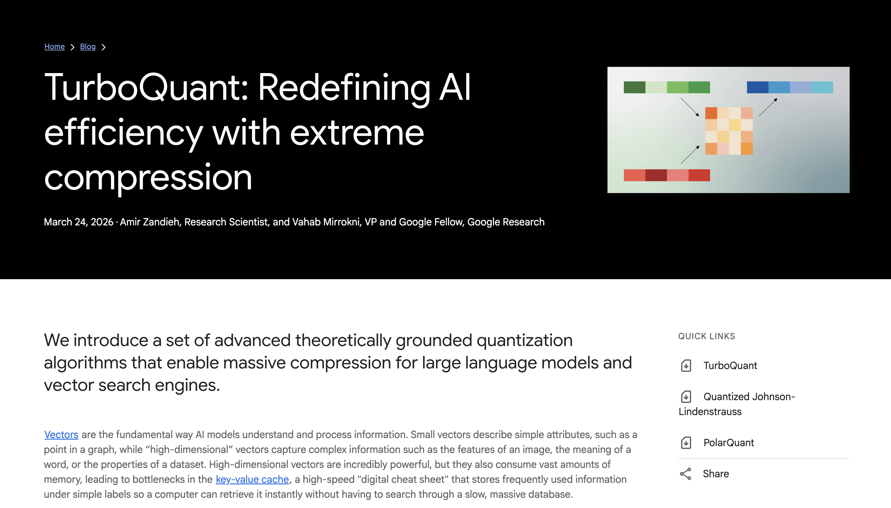

---

## RAM going down

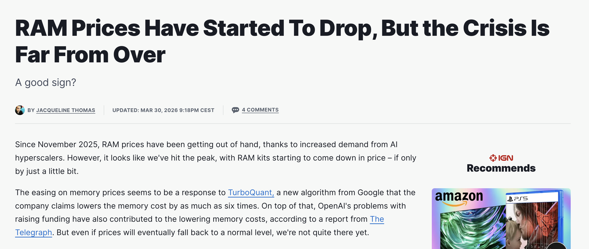

---

## TurboQuant

### Kompresja KV Cache bez utraty jakości

**Google Research (2025, ICLR 2026):** algorytm **TurboQuant** kompresuje KV Cache z 16-bit do ~3.5-bit na kanał.

**Co to oznacza?**

- **6× mniej pamięci** na KV Cache
- **Bez ponownego trenowania** modelu
- **„Quality neutral"** przy 3.5 bit – model odpowiada identycznie

**Jak działa (uproszczenie):**

1. **Losowa rotacja** wektorów K/V (rozrzuca informację równomiernie)
2. **Kwantyzacja skalarna** – zaokrąglenie do kilku bitów
3. **Korekcja QJL** – 1-bitowa transformacja naprawiająca błędy zaokrąglenia

**Wynik:** te same odpowiedzi, ułamek pamięci.

> _Notatka prowadzącego:_ "Dlaczego to ważne? Bo sprawia, że AI staje się DOSTĘPNIEJSZE. Mniejsze wymagania pamięci = tańsze GPU = więcej ludzi może uruchamiać modele lokalnie = demokratyzacja AI. I to bez żadnej utraty jakości – to jest klucz."

---

## Łatanie vs zastępowanie

### Dwie strategie wobec tego samego problemu

**TurboQuant** = łatka na Transformera
- Transformer ma KV Cache → TurboQuant go kompresuje
- Sprytne, skuteczne, **ale nie zmienia architektury**
- Problem O(N²) wciąż istnieje – tylko zajmuje mniej pamięci

**BDH** = nowa architektura
- **Nie ma globalnej atencji** → nie ma KV Cache do kompresji
- Lokalne interakcje O(N) → problem **nie powstaje**
- BDH **nie potrzebuje** TurboQuanta

**Oba podejścia są wartościowe** – TurboQuant pomaga DZIŚ, BDH to nowy kierunek.

> _Notatka prowadzącego:_ "To jest ważna lekcja o innowacji. Czasem łatasz istniejący system – i to jest dobre, bo ludzie go TERAZ używają. Czasem budujesz nowy system od zera – i to jest trudniejsze, ale rozwiązuje problem fundamentalnie. Dobry inżynier wie, KIEDY łatać, a kiedy zastępować. Dobry kognitywista wie, DLACZEGO."

---

## Czego się nauczyliście

### Uczciwa samoocena

**To już umiecie:**

- ✅ Jak LLM generuje tekst (tokenizacja, predykcja, MoE)
- ✅ Dlaczego persona działa (filtr kognitywny → expert routing)
- ✅ Pamięć agenta (Memory Stream, Lost in the Middle, kompresja)
- ✅ Jak agent działa w świecie (Function Calling, ReAct)
- ✅ Ograniczenia i etyka (grounding, alignment, bias)
- ✅ Post-Transformer: BDH, TurboQuant i kierunek, w którym zmierza AI


---

## 3 rzeczy do zrobienia po tym wykładzie

### Konkretne, proste, natychmiastowe

1. **Ściągnij CLI lub IDE. Gemini CLI/Antigravity, Cloude Code** – użyj rzeczy, których się nauczyłeś/łaś, żeby stworzyć swojego asystenta. Buduj dla niego mechanizmy.

2. **Przeczytaj JEDEN artykuł** polecam: Park et al. "Generative Agents", albo TurboQuant. Nauczcie się pytać artykuły waszych agentów

---

## Real use cases

Dodanie swojej funkcjonalności do softu OpenSource
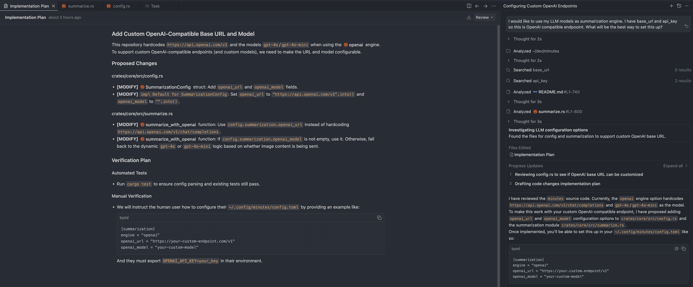

---

## Real use cases

Robienie wykładów

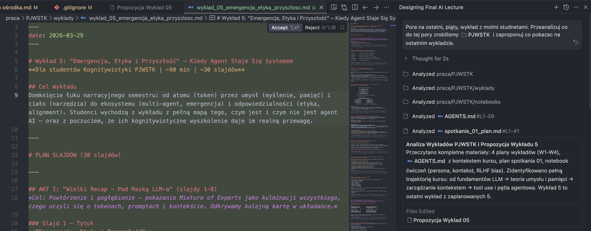

---

## Real use cases

Rozwijanie narzędzi

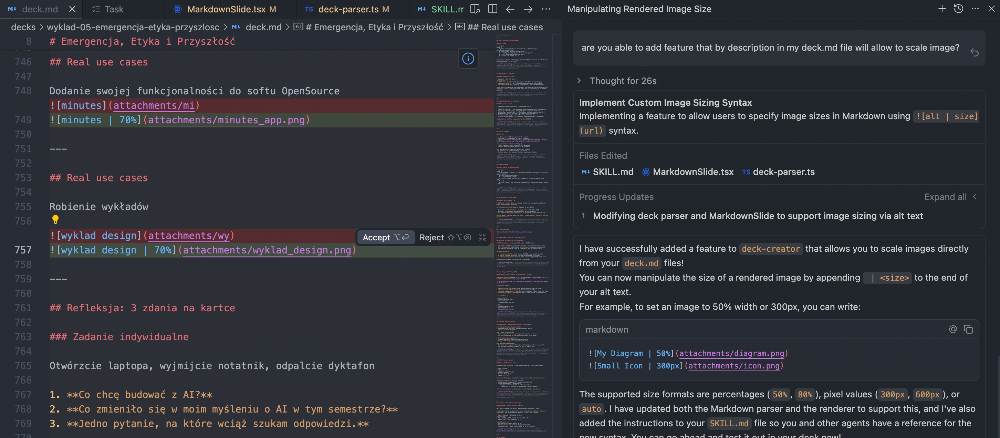

---

## Real use cases

Generowanie assetów

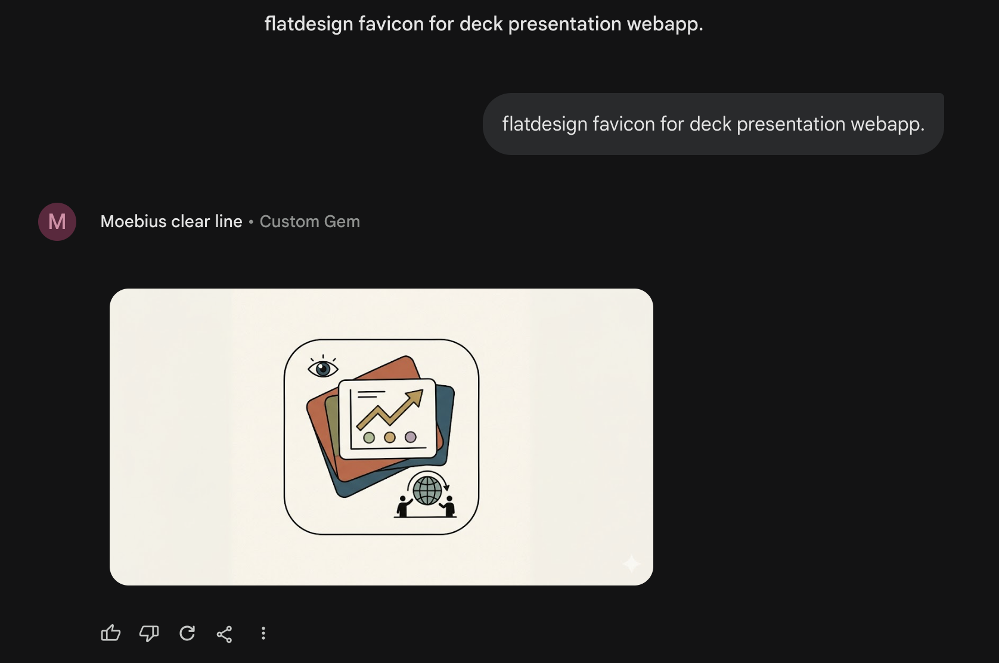

---
## Refleksja: 3 zdania na kartce

### Zadanie indywidualne

Otwórzcie laptopa, wyjmijcie notatnik, odpalcie dyktafon

1. **Co chcę budować z AI?**
2. **Co zmieniło się w moim myśleniu o AI w tym semestrze?**
3. **Jedno pytanie, na które wciąż szukam odpowiedzi.**

---

## Ostatni slajd

### "Nie pytaj, co AI zrobi dla Ciebie. Pytaj, co AI zrobi ZA Ciebie."

Dziękuję za ten semestr.  
Jeśli macie jakieś pytania albo potrzebujecie zasobów do grindu zapraszam do kontaktu.

jakub@zboina.pl

[LinkedIn](https://www.linkedin.com/in/jakubzboina/)

**Teamsy PJATKowe**

